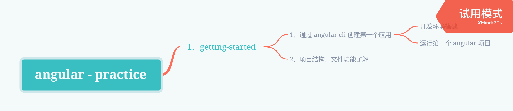
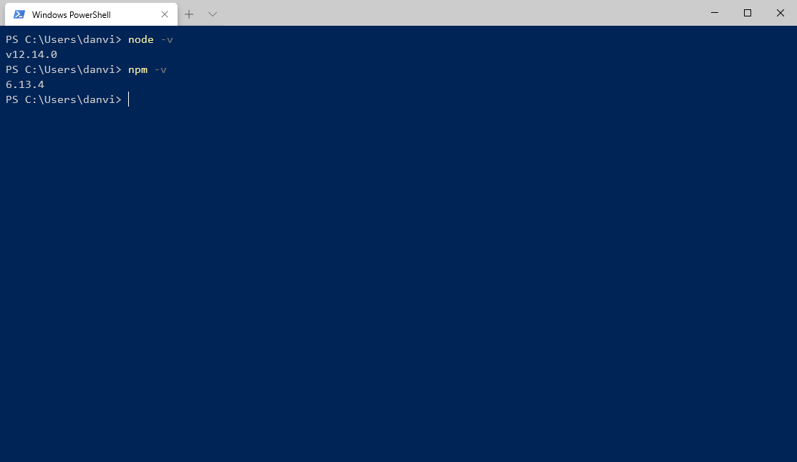
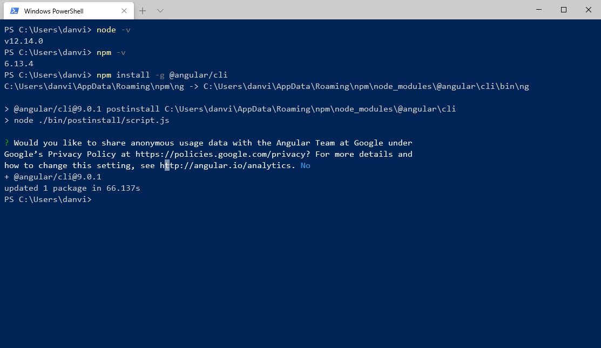
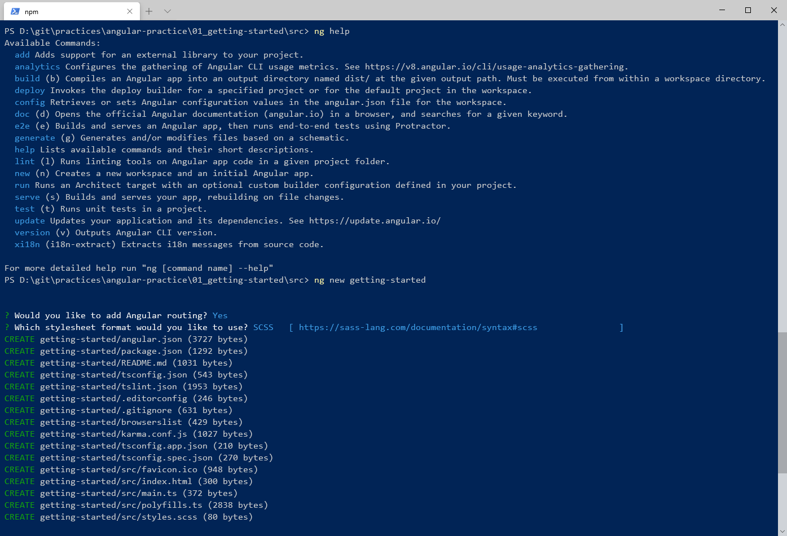
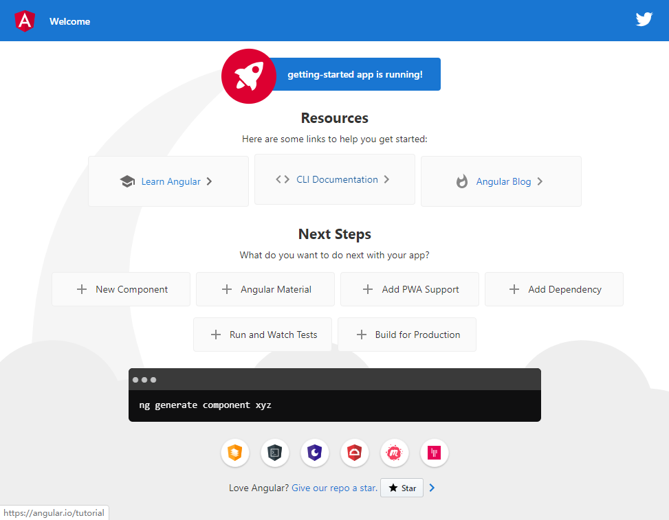
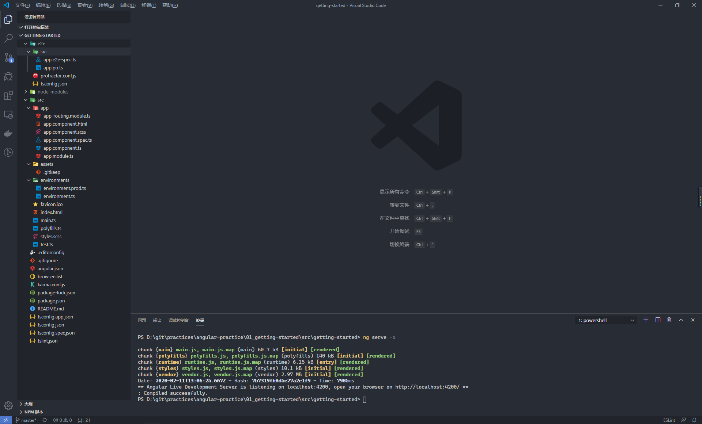

## Knowledge Graph




## Step by Step

### 1、通过 Angular CLI 创建第一个 Angular 应用

#### 1.1、开发环境搭建

前提条件

- node.js 版本高于 10.9.0
- 包含 npm 客户端

```shell
## 查看 node 版本
node -v

## 查看 npm 版本
npm -v
```



全局安装 Angular CLI

```shell
## 在电脑上以全局安装的方式安装 angular cli
npm install -g @angular/cli
```



验证是否安装成功

```shell
## 查看 angular cli 版本
ng v

## 查看 angular cli 中的各种命令解释
ng help
```


#### 1.2、运行第一个 Angular 应用

通过 Angular CLI 命令来创建一个新的应用

```shell
## 指定位置，创建新的 angular 应用
ng new my-app
```

常用命令参数

| options       | 解释                                     |
| ------------- | ---------------------------------------- |
| --force       | 强制覆盖现有文件                         |
| --skipInstall | 创建项目时跳过 npm install 命令          |
| --strict      | 在代码中使用更严格的 typescript 编译选项 |



运行项目

```shell
## 运行项目
ng serve
```

常用命令参数

| options     | 解释               |
| ----------- | ------------------ |
| --open / -o | 是否直接打开浏览器 |
| --port      | 指定程序运行的端口 |




### 2、项目结构、文件功能了解



- e2e - 端到端测试文件

  - src - 单元测试源代码路径
    - app.e2e-spec.ts - 针对当前应用的端到端单元测试文件
    - app.po.ts - 单元测试源文件
  - protractor.conf.js - protractor 测试工具配置文件
  - tsconfig.json - 继承于工作空间根目录的 typescript 配置文件

- src - 工作空间 [^1] 最外层根项目的源代码路径

  - app - 系统所提供的各种功能
    - app-routing.module.ts - 项目的路由模块，用来定义项目的前端路由信息
    - app.component.html - 项目的根组件所关联的 HTML 页面
    - app.component.scss  - 项目的根组件 HTML 页面的样式信息
    - app.component.spec.ts - 项目的根组件单元测试文件
    - app.component.ts - 项目的根组件逻辑
    - app.module.ts - 应用的根模块
  - assets - 系统需要使用的静态资源文件
  - environments - 针对不同环境的构建配置选项
  - favicon.ico - 网站图标
  - index.html - 应用的主页面
  - main.ts - 应用的入口程序
  - polyfills.ts - 针对不同浏览器对于原生 API 的支持程度不相同的情况，用来抹平不同浏览器之间的支持差异 [^2]
  - styles.scss - 项目的全局样式文件
  - test.ts - 单元测试的主入口程序

- .editorconfig - 针对不同代码编辑器间的代码风格规范

- .gitignore - git 忽略的文件

- angular.json - 应用于当前工作空间的一些默认配置以及供 angular cli 和开发工具使用的配置信息

- browserslist - 项目所针对的目标浏览器 [^3]

- karma.conf.js - 基于 node.js 的 javascript 测试执行过程管理工具

- package-lock.json - 针对当前工作空间使用到 npm 包，安装到 node_modules 时的版本信息

- package.json - 当前工作空间中所有项目会使用到的 npm 包依赖

- README.md - 当前工作空间最外层根应用的简介文件

- tsconfig.app.json - 当前工作空间最外层根应用的专属  typescript 配置文件

- tsconfig.json - 当前工作空间中各个项目的基础 typescript 配置文件

- tsconfig.spec.json - 当前工作空间最外层根应用的专属 tslint 配置文件

- tslint.json - 当前工作空间中各个项目的基础 tslint 配置文件

  

[^1]: 工作空间类似于 .NET 项目中的解决方案，在一个工作空间内可以创建多个的项目
[^2]:现代浏览器支持的某些原生 API，当用户使用老版本的浏览器或某些浏览器时并不支持，只要使用了 polyfills 这个库， 即可对于这些无法使用的浏览器添加支持，使用方法也无需更改（PS：针对的是原生的 API）
[^3]: 还是因为不同浏览器支持的特性不同，或者是 css 样式前缀不同，通过 browserslist 来告诉项目中的各种前端工具，完成自动配置的过程

