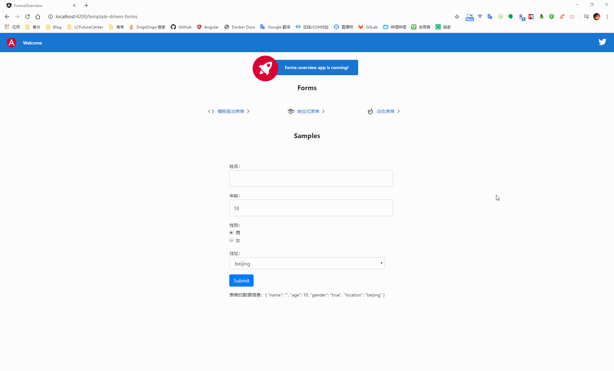
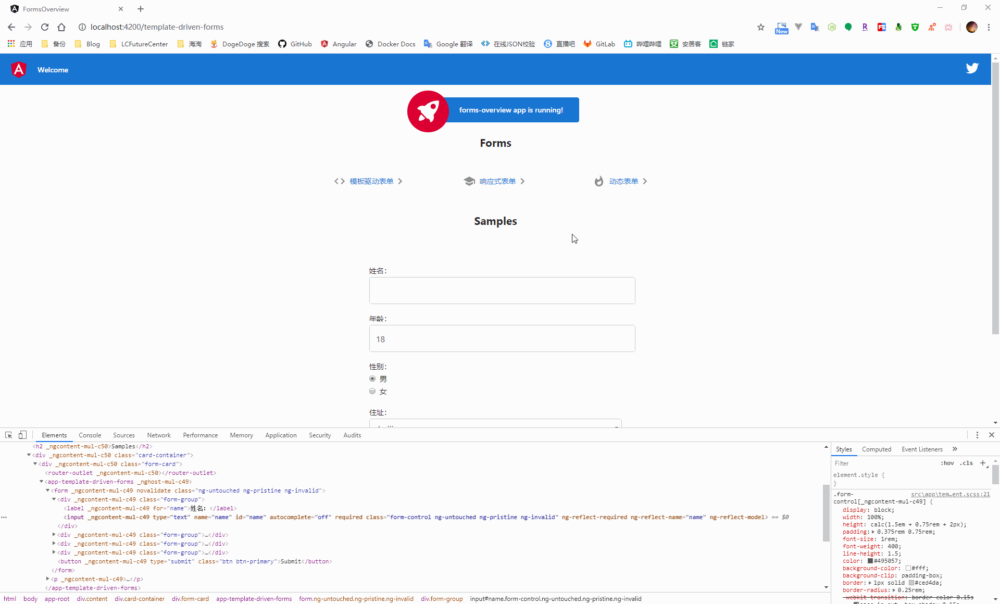
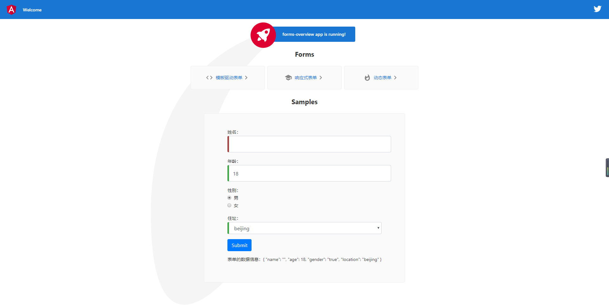
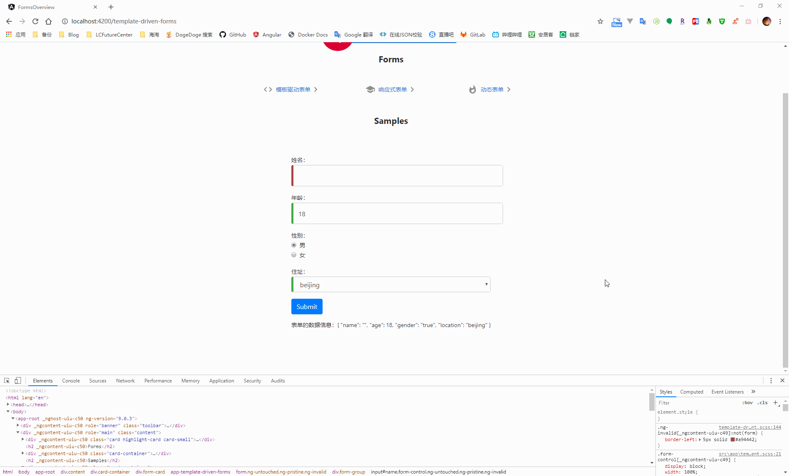
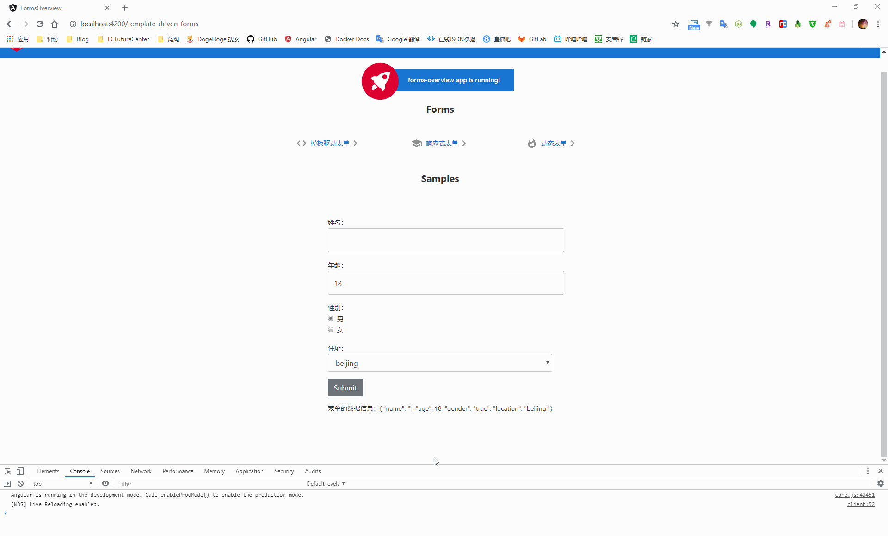

## Knowledge Graph


## Step by Step

### 1、表单简介

用来处理用户的输入，通过从视图中捕获用户的输入事件、验证用户输入的是否满足条件，从而创建出表单模型修改组件中的数据模型，达到获取用户输入数据的功能

|          | 模板驱动表单         | 响应式表单         |
| -------- | -------------------- | ------------------ |
| 建立表单 | 由组件隐式的完成创建 | 在组件类中进行创建 |
| 数据模式 | 非结构化数据         | 结构化数据         |
| 表单验证 | 指令                 | 函数               |


### 2、模板驱动表单

通过使用表单的专属指令（例如 ngModel 进行双向数据绑定）将数据值和一些对于用户的行为约束（某个字段必须填啊、某个字段长度超过了长度限制啊）绑定到组件的模板中，从而完成与用户的交互

#### 2.1、模板驱动表单的双向数据绑定

在根模块中引入 FormsModule，并添加到根应用模模块中的 imports 数组中

```typescript
import { BrowserModule } from '@angular/platform-browser';
import { NgModule } from '@angular/core';

// 引入 FormsModule
import { FormsModule } from '@angular/forms';

import { AppRoutingModule } from './app-routing.module';
import { AppComponent } from './app.component';
import { ReactiveFormsComponent } from './reactive-forms/reactive-forms.component';
import { DynamicFormsComponent } from './dynamic-forms/dynamic-forms.component';
import { TemplateDrivenFormsComponent } from './template-driven-forms/template-driven-forms.component';

@NgModule({
  declarations: [
    AppComponent,
    ReactiveFormsComponent,
    DynamicFormsComponent,
    TemplateDrivenFormsComponent
  ],
  imports: [
    BrowserModule,
    AppRoutingModule,
    FormsModule // 添加到应用模块中
  ],
  providers: [],
  bootstrap: [AppComponent]
})
export class AppModule { }
```

新建一个类文件，用来承载组件与模板之间进行双向数据绑定的数据信息

```bash
ng g class classes/hero
```

```typescript
export class Hero {

  /**
   * ctor
   * @param name 姓名
   * @param age 年纪
   * @param gender 性别
   * @param location 住址
   */
  constructor(public name: string, public age: number, public gender: string, public location: string) {
  }
}
```

在组件的模板中创建承载数据的表单信息，并使用 ngModel 完成组件与模板之间的数据双向绑定

```html
<form>
  <div class="form-group">
    <label for="name">姓名：</label>
    <input type="text" name="name" id="name" [(ngModel)]="hero.name" class="form-control" autocomplete="off" required minlength="4">
  </div>
  <div class="form-group">
    <label for="age">年龄：</label>
    <input type="number" name="age" id="age" [(ngModel)]="hero.age" class="form-control" required>
  </div>
  <div class="form-group">
    <label for="gender">性别：</label>
    <div class="form-check" *ngFor="let gender of genders">
      <input class="form-check-input" type="radio" name="gender" id="{{gender.id}}" value="{{gender.value}}"
        [(ngModel)]="hero.gender">
      <label class="form-check-label" for="{{gender.id}}">
        {{gender.text}}
      </label>
    </div>
  </div>
  <div class="form-group">
    <label for="location">住址：</label>
    <select name="location" id="location" [(ngModel)]="hero.location" class="form-control" required>
      <option value="{{location}}" *ngFor="let location of locations">{{location}}</option>
    </select>
  </div>
  <button type="submit" (click)="submit()" class="btn btn-primary">Submit</button>
</form>

<p>
  表单的数据信息：{{hero | json}}
</p>
```

```typescript
import { Component, OnInit } from '@angular/core';

import { Hero } from './../classes/hero';

@Component({
  selector: 'app-template-driven-forms',
  templateUrl: './template-driven-forms.component.html',
  styleUrls: ['./template-driven-forms.component.scss']
})
export class TemplateDrivenFormsComponent implements OnInit {
  constructor() { }

  // 性别选项
  public genders = [{
    id: 'male', text: '男', value: true
  }, {
    id: 'female', text: '女', value: false
  }];

  /**
   * 住址下拉
   */
  public locations: Array<string> = ['beijing', 'shanghai', 'hangzhou', 'wuhan'];

  hero = new Hero('', 18, 'true', 'beijing');

  ngOnInit(): void {
  }

  submit() {

  }
}
```



在使用 ngModel 进行模板绑定时，angular 在 form 标签上自动附加了一个 NgForm 指令，因为 NgForm 指令会控制表单中带有 ngModel 指令和 name 属性的元素，而 name 属性则是 angular 用来注册控件的 key，所以在表单中使用 ngModel 进行双向数据绑定时，必须要添加 name 属性

#### 2.2、跟踪表单控件的状态

在表单中使用 ngModel 之后，NgModel 指令通过更新控件的 css 类，达到反映控件状态的目的

| 状态             | 发生时的 css 类 | 没发生的 css 类 |
| ---------------- | --------------- | --------------- |
| 控件被访问       | ng-touched      | ng-untouched    |
| 控件的值发生变化 | ng-dirty        | ng-pristine     |
| 控件的值是否有效 | ng-valid        | ng-invalid      |



通过这些控件的 css 类样式，就可以通过添加自定义的 css 样式在用户输入内容不满足条件时进行提示

```css
.ng-valid[required], .ng-valid.required  {
  border-left: 5px solid #42A948; /* green */
}

.ng-invalid:not(form)  {
  border-left: 5px solid #a94442; /* red */
}
```




#### 2.3、数据有效性验证

某些时候需要对于用户输入的信息做有效性验证，此时可以在控件上添加上[原生的 HTML 表单验证器](https://developer.mozilla.org/en-US/docs/Web/Guide/HTML/HTML5/Constraint_validation)来设定验证条件，当表单控件的数据发生变化时，angular 会通过指令的方式对数据进行验证，从而生成错误信息列表

在进行用户输入数据有效性验证时，在控件上通过添加一个模板引用变量来暴露出 ngModel，从而获取到控件的状态信息，之后就可以通过获取错误信息列表来进行反馈

```html
<div class="form-group">
    <label for="name">姓名：</label>
    <!--
      将 ngModel 指令通过模板引用变量的形式暴露出来，从而获取到控件的状态
     -->
    <input type="text" name="name" id="name" [(ngModel)]="hero.name" class="form-control" autocomplete="off" required
      minlength="4" #name="ngModel">
    <!--
      在用户有改动数据 or 访问控件之后才对数据的有效性进行验证
     -->
    <div *ngIf="name.invalid && (name.dirty || name.touched)" class="alert alert-danger">
      <div *ngIf="name.errors.required">
        姓名不能为空
      </div>
      <div *ngIf="name.errors.minlength">
        姓名信息不能少于 4 个字符长度
      </div>
    </div>
  </div>
```



在数据验证失败的情况下，对于系统来说，表单是不允许提交的，因此可以将提交事件绑定到表单的 ngSubmit 事件属性上，通过模板引用变量的形式，在提交按钮处进行数据有效性判断，当无效时，禁用表单的提交按钮

```html
<form (ngSubmit)="submit()" #heroForm="ngForm">
  <div class="form-group">
    <label for="name">姓名：</label>
    <!--
      将 ngModel 指令通过模板引用变量的形式暴露出来，从而获取到控件的状态
     -->
    <input type="text" name="name" id="name" [(ngModel)]="hero.name" class="form-control" autocomplete="off" required
      minlength="4" #name="ngModel">
    <!--
      在用户有改动数据 or 访问控件之后才对数据的有效性进行验证
     -->
    <div *ngIf="name.invalid && (name.dirty || name.touched)" class="alert alert-danger">
      <div *ngIf="name.errors.required">
        姓名不能为空
      </div>
      <div *ngIf="name.errors.minlength">
        姓名信息不能少于 4 个字符长度
      </div>
    </div>
  </div>
  <div class="form-group">
    <label for="age">年龄：</label>
    <input type="number" name="age" id="age" [(ngModel)]="hero.age" class="form-control" required>
  </div>
  <div class="form-group">
    <label for="gender">性别：</label>
    <div class="form-check" *ngFor="let gender of genders">
      <input class="form-check-input" type="radio" name="gender" id="{{gender.id}}" value="{{gender.value}}"
        [(ngModel)]="hero.gender">
      <label class="form-check-label" for="{{gender.id}}">
        {{gender.text}}
      </label>
    </div>
  </div>
  <div class="form-group">
    <label for="location">住址：</label>
    <select name="location" id="location" [(ngModel)]="hero.location" class="form-control" required>
      <option value="{{location}}" *ngFor="let location of locations">{{location}}</option>
    </select>
  </div>
  <button type="submit" [disabled]="!heroForm.form.valid" class="btn btn-primary">Submit</button>
</form>
```



#### 2.4、表单中的数据流

模板绑定表单是通过 ngModel 实现的双向数据绑定，因此在组件中修改数据或者是在视图模板中修改数据，最终都会影响到表单中的数据

- 在视图中修改数据
  1. 触发控件的事件
- 在组件中修改数据


### 3、响应式表单

#### 3.1、基础概念


### 4、表单的自定义数据验证


### 5、动态表单