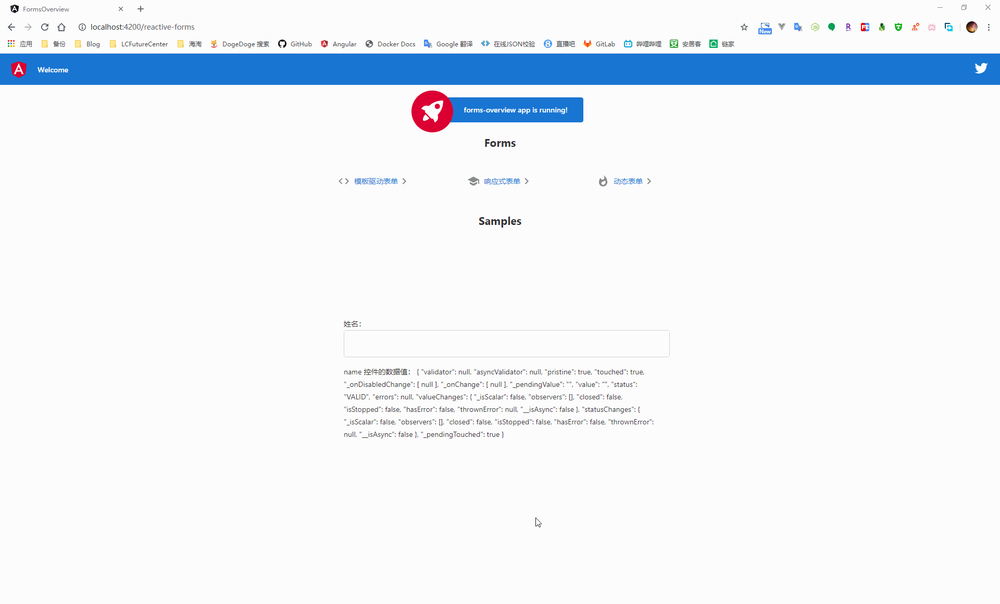
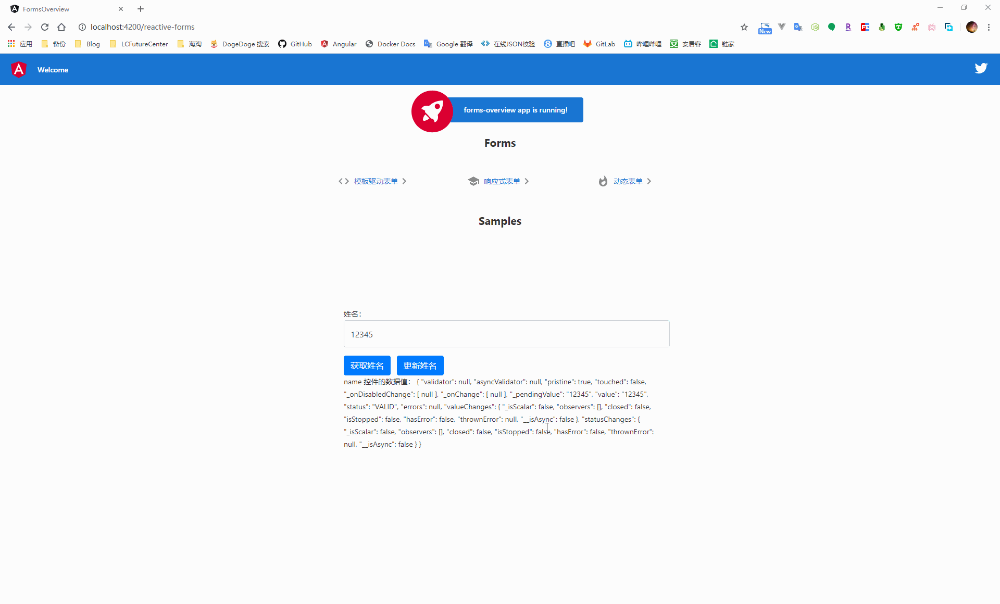
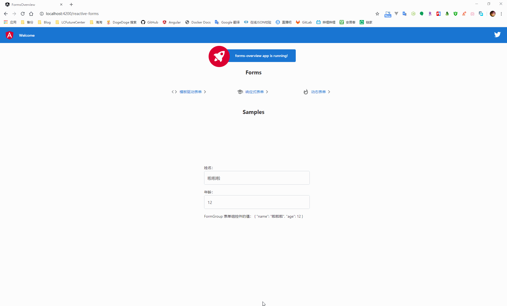
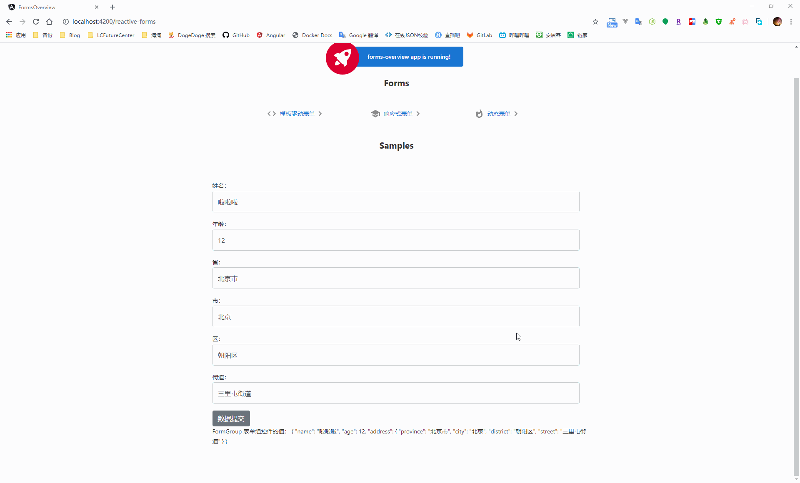
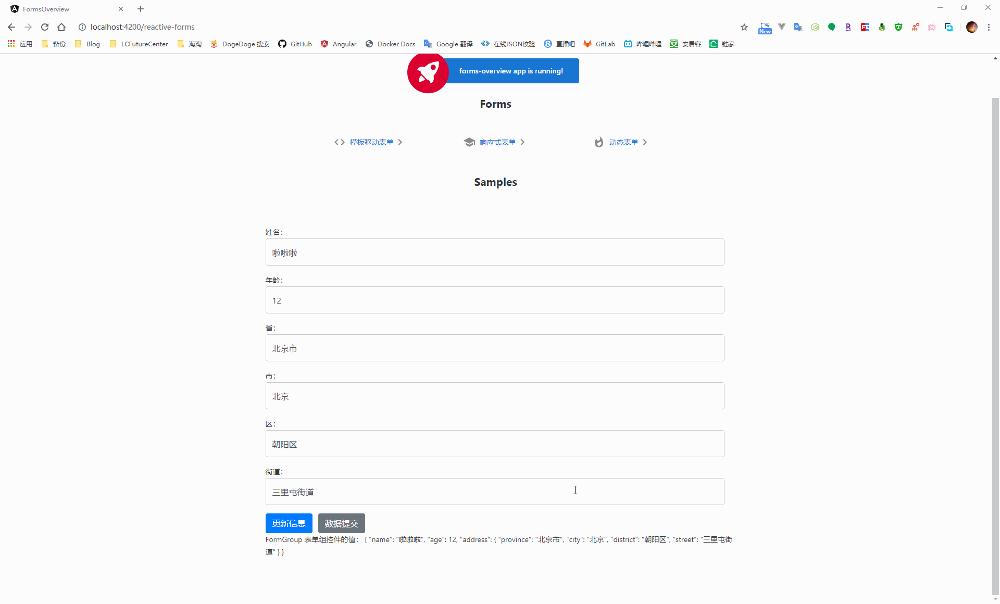
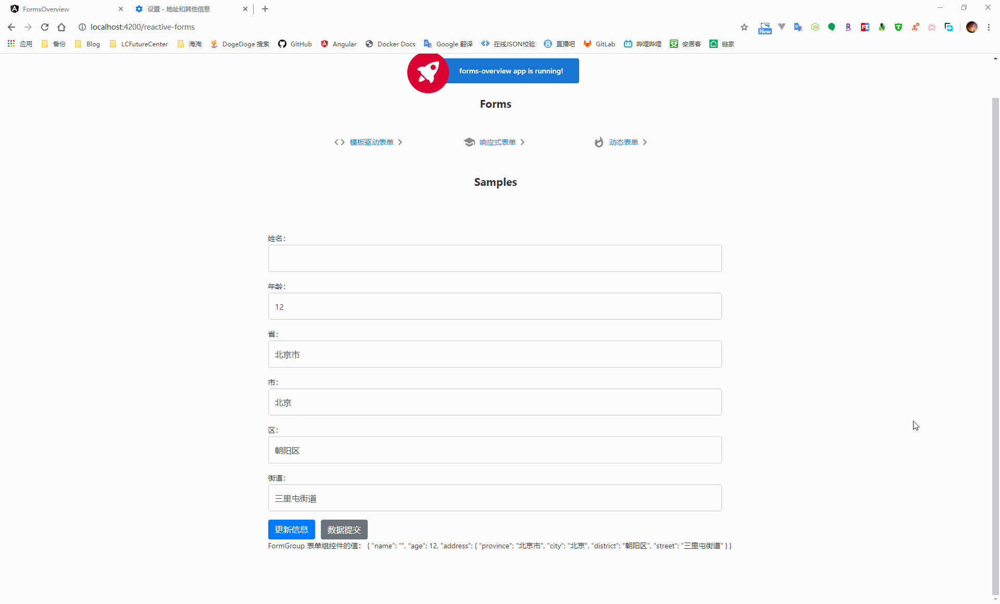
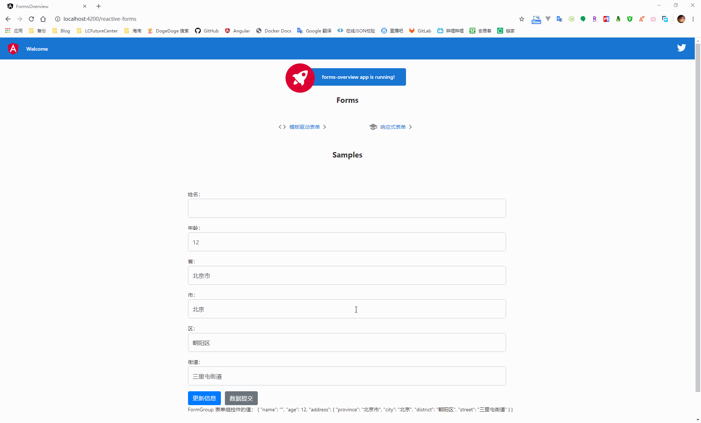
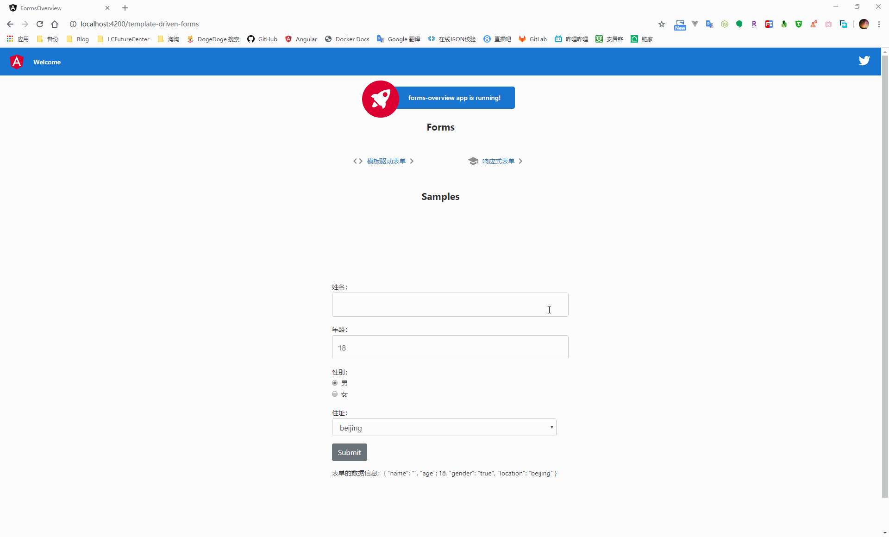

## Knowledge Graph


## Step by Step

### 1、表单简介

用来处理用户的输入，通过从视图中捕获用户的输入事件、验证用户输入的是否满足条件，从而创建出表单模型修改组件中的数据模型，达到获取用户输入数据的功能

|          | 模板驱动表单                 | 响应式表单                       |
| -------- | ---------------------------- | -------------------------------- |
| 建立表单 | 由组件隐式的创建表单控件实例 | 在组件类中进行显示的创建控件实例 |
| 表单验证 | 指令                         | 函数                             |

在表单数据发生变更时，模板驱动表单通过修改 ngModel 绑定的数据模型来完成数据更新，而响应式表单在表单数据发生变更时，FormControl 实例会返回一个新的数据模型，而不是直接修改原来的数据模型


### 2、模板驱动表单

通过使用表单的专属指令（例如 ngModel 进行双向数据绑定）将数据值和一些对于用户的行为约束（某个字段必须填啊、某个字段长度超过了长度限制啊）绑定到组件的模板中，从而完成与用户的交互

#### 2.1、模板驱动表单的双向数据绑定

在根模块中引入 FormsModule，并添加到根模块的 imports 数组中

```typescript
import { BrowserModule } from '@angular/platform-browser';
import { NgModule } from '@angular/core';

// 引入 FormsModule
import { FormsModule } from '@angular/forms';

import { AppRoutingModule } from './app-routing.module';
import { AppComponent } from './app.component';
import { TemplateDrivenFormsComponent } from './template-driven-forms/template-driven-forms.component';

@NgModule({
  declarations: [
    AppComponent,
    ReactiveFormsComponent,
    DynamicFormsComponent,
    TemplateDrivenFormsComponent
  ],
  imports: [
    BrowserModule,
    AppRoutingModule,
    FormsModule // 添加到应用模块中
  ],
  providers: [],
  bootstrap: [AppComponent]
})
export class AppModule { }
```

新建一个类文件，用来承载组件与模板之间进行双向数据绑定的数据信息

```bash
ng g class classes/hero
```

```typescript
export class Hero {

  /**
   * ctor
   * @param name 姓名
   * @param age 年纪
   * @param gender 性别
   * @param location 住址
   */
  constructor(public name: string, public age: number, public gender: string, public location: string) {
  }
}
```

在组件的模板中创建承载数据的表单信息，并使用 ngModel 完成组件与模板之间的数据双向绑定

```html
<form>
  <div class="form-group">
    <label for="name">姓名：</label>
    <input type="text" name="name" id="name" [(ngModel)]="hero.name" class="form-control" autocomplete="off" required minlength="4">
  </div>
  <div class="form-group">
    <label for="age">年龄：</label>
    <input type="number" name="age" id="age" [(ngModel)]="hero.age" class="form-control" required>
  </div>
  <div class="form-group">
    <label for="gender">性别：</label>
    <div class="form-check" *ngFor="let gender of genders">
      <input class="form-check-input" type="radio" name="gender" id="{{gender.id}}" value="{{gender.value}}"
        [(ngModel)]="hero.gender">
      <label class="form-check-label" for="{{gender.id}}">
        {{gender.text}}
      </label>
    </div>
  </div>
  <div class="form-group">
    <label for="location">住址：</label>
    <select name="location" id="location" [(ngModel)]="hero.location" class="form-control" required>
      <option value="{{location}}" *ngFor="let location of locations">{{location}}</option>
    </select>
  </div>
  <button type="submit" (click)="submit()" class="btn btn-primary">Submit</button>
</form>

<p>
  表单的数据信息：{{hero | json}}
</p>
```

```typescript
import { Component, OnInit } from '@angular/core';

import { Hero } from './../classes/hero';

@Component({
  selector: 'app-template-driven-forms',
  templateUrl: './template-driven-forms.component.html',
  styleUrls: ['./template-driven-forms.component.scss']
})
export class TemplateDrivenFormsComponent implements OnInit {
  constructor() { }

  // 性别选项
  public genders = [{
    id: 'male', text: '男', value: true
  }, {
    id: 'female', text: '女', value: false
  }];

  /**
   * 住址下拉
   */
  public locations: Array<string> = ['beijing', 'shanghai', 'hangzhou', 'wuhan'];

  hero = new Hero('', 18, 'true', 'beijing');

  ngOnInit(): void {
  }

  submit() {

  }
}
```


在使用 ngModel 进行模板绑定时，angular 在 form 标签上自动附加了一个 NgForm 指令，因为 NgForm 指令会控制表单中带有 ngModel 指令和 name 属性的元素，而 name 属性则是 angular 用来注册控件的 key，所以在表单中使用 ngModel 进行双向数据绑定时，必须要添加 name 属性

#### 2.2、跟踪表单控件的状态

在表单中使用 ngModel 之后，NgModel 指令通过更新控件的 css 类，达到反映控件状态的目的

| 状态             | 发生时的 css 类 | 没发生的 css 类 |
| ---------------- | --------------- | --------------- |
| 控件被访问       | ng-touched      | ng-untouched    |
| 控件的值发生变化 | ng-dirty        | ng-pristine     |
| 控件的值是否有效 | ng-valid        | ng-invalid      |


通过这些控件的 css 类样式，就可以通过添加自定义的 css 样式在用户输入内容不满足条件时进行提示

```css
.ng-valid[required], .ng-valid.required  {
  border-left: 5px solid #42A948; /* green */
}

.ng-invalid:not(form)  {
  border-left: 5px solid #a94442; /* red */
}
```


#### 2.3、数据的有效性验证

某些时候需要对于用户输入的信息做有效性验证，此时可以在控件上添加上[原生的 HTML 表单验证器](https://developer.mozilla.org/en-US/docs/Web/Guide/HTML/HTML5/Constraint_validation)来设定验证条件，当表单控件的数据发生变化时，angular 会通过指令的方式对数据进行验证，从而生成错误信息列表

在进行用户输入数据有效性验证时，在控件上通过添加一个模板引用变量来暴露出 ngModel，从而在模板中获取到指定控件的状态信息，之后就可以通过获取错误信息列表来进行反馈

```html
<div class="form-group">
    <label for="name">姓名：</label>
    <!--
      将 ngModel 指令通过模板引用变量的形式暴露出来，从而获取到控件的状态
     -->
    <input type="text" name="name" id="name" [(ngModel)]="hero.name" class="form-control" autocomplete="off" required
      minlength="4" #name="ngModel">
    <!--
      在用户有改动数据 or 访问控件之后才对数据的有效性进行验证
     -->
    <div *ngIf="name.invalid && (name.dirty || name.touched)" class="alert alert-danger">
      <div *ngIf="name.errors.required">
        姓名不能为空
      </div>
      <div *ngIf="name.errors.minlength">
        姓名信息不能少于 4 个字符长度
      </div>
    </div>
  </div>
```


在数据验证失败的情况下，对于系统来说，表单是不允许提交的，因此可以将提交事件绑定到表单的 ngSubmit 事件属性上，通过模板引用变量的形式，在提交按钮处进行数据有效性判断，当无效时，禁用表单的提交按钮

```html
<form (ngSubmit)="submit()" #heroForm="ngForm">
  <div class="form-group">
    <label for="name">姓名：</label>
    <!--
      将 ngModel 指令通过模板引用变量的形式暴露出来，从而获取到控件的状态
     -->
    <input type="text" name="name" id="name" [(ngModel)]="hero.name" class="form-control" autocomplete="off" required
      minlength="4" #name="ngModel">
    <!--
      在用户有改动数据 or 访问控件之后才对数据的有效性进行验证
     -->
    <div *ngIf="name.invalid && (name.dirty || name.touched)" class="alert alert-danger">
      <div *ngIf="name.errors.required">
        姓名不能为空
      </div>
      <div *ngIf="name.errors.minlength">
        姓名信息不能少于 4 个字符长度
      </div>
    </div>
  </div>
  <div class="form-group">
    <label for="age">年龄：</label>
    <input type="number" name="age" id="age" [(ngModel)]="hero.age" class="form-control" required>
  </div>
  <div class="form-group">
    <label for="gender">性别：</label>
    <div class="form-check" *ngFor="let gender of genders">
      <input class="form-check-input" type="radio" name="gender" id="{{gender.id}}" value="{{gender.value}}"
        [(ngModel)]="hero.gender">
      <label class="form-check-label" for="{{gender.id}}">
        {{gender.text}}
      </label>
    </div>
  </div>
  <div class="form-group">
    <label for="location">住址：</label>
    <select name="location" id="location" [(ngModel)]="hero.location" class="form-control" required>
      <option value="{{location}}" *ngFor="let location of locations">{{location}}</option>
    </select>
  </div>
  <button type="submit" [disabled]="!heroForm.form.valid" class="btn btn-primary">Submit</button>
</form>
```


### 3、响应式表单

#### 3.1、快速上手

响应式表单依赖于  ReactiveFormsModule 模块，因此在使用前需要在根模块中引入

```typescript
import { BrowserModule } from '@angular/platform-browser';
import { NgModule } from '@angular/core';

// 引入 ReactiveFormsModule
import { ReactiveFormsModule } from '@angular/forms';

import { AppRoutingModule } from './app-routing.module';
import { AppComponent } from './app.component';
import { ReactiveFormsComponent } from './reactive-forms/reactive-forms.component';

@NgModule({
  declarations: [
    AppComponent,
    ReactiveFormsComponent,
    DynamicFormsComponent,
    TemplateDrivenFormsComponent
  ],
  imports: [
    BrowserModule,
    AppRoutingModule,
    ReactiveFormsModule // 添加到应用模块中
  ],
  providers: [],
  bootstrap: [AppComponent]
})
export class AppModule { }
```

在使用响应式表单时，一个 FormControl 类的实例对应于一个表单控件，在使用时，通过将控件的实例赋值给属性，后续则可以通过监听这个自定义的属性来跟踪表单控件的值和状态

```typescript
import { Component, OnInit } from '@angular/core';

// 引入 FormControl 对象
import { FormControl } from '@angular/forms';

@Component({
  selector: 'app-reactive-forms',
  templateUrl: './reactive-forms.component.html',
  styleUrls: ['./reactive-forms.component.scss']
})
export class ReactiveFormsComponent implements OnInit {

  // 定义属性用来承接 FormControl 实例
  public name = new FormControl('');

  constructor() { }

  ngOnInit(): void {
  }

}
```

当在组件中创建好控件实例后，通过给视图模板上的表单控件添加 formControl 属性绑定，从而将控件实例与模板中的表单控件关联起来

```html
<form>
  <div class="form-group">
    <label for="name">姓名：</label>
    <input type="text" id="name" [formControl]='name' class="form-control" autocomplete="off">
  </div>
</form>


<div>
  name 控件的数据值： {{ name | json }}
</div>
```



通过使用 FormControl 控件的 value 属性，可以获得当前表单控件的一份数据值拷贝，通过 setValue 方法则可以更新表单的控件值

```typescript
import { Component, OnInit } from '@angular/core';

// 引入 FormControl 对象
import { FormControl } from '@angular/forms';

@Component({
  selector: 'app-reactive-forms',
  templateUrl: './reactive-forms.component.html',
  styleUrls: ['./reactive-forms.component.scss']
})
export class ReactiveFormsComponent implements OnInit {

  // 定义属性用来承接 FormControl 实例
  public name = new FormControl('12345');

  constructor() { }

  ngOnInit(): void {
  }

  getName() {
    alert(this.name.value);
  }

  setName() {
    this.name.setValue(1111111);
  }
}
```



#### 3.2、通过 FomGroup 组合多个控件

一个表单不可能只有一个控件，通过在组件中构造 FormGroup 实例来完成对于多个表单控件的统一管理

在使用 FormGroup 时，同样在组件中定义一个属性用来承载控件组实例，然后将控件组中的每一个控件作为属性值添加到实例中

```typescript
import { Component, OnInit } from '@angular/core';

// 引入 FormControl 和 FormGroup 对象
import { FormControl, FormGroup } from '@angular/forms';

@Component({
  selector: 'app-reactive-forms',
  templateUrl: './reactive-forms.component.html',
  styleUrls: ['./reactive-forms.component.scss']
})
export class ReactiveFormsComponent implements OnInit {

  // 定义对象属性来承接 FormGroup 实例
  public profileForm = new FormGroup({
    name: new FormControl('啦啦啦'),
    age: new FormControl(12)
  });

  constructor() { }

  ngOnInit(): void {
  }
}
```

在视图模板中，将承接 FormGroup 实例的属性通过 formGroup 指令绑定到 form 元素，然后将控件组的每一个属性通过 formControlName 绑定到具体对应的表单控件上


```html
<form [formGroup]='profileForm'>
  <div class="form-group">
    <label for="name">姓名：</label>
    <input type="text" id="name" formControlName='name' class="form-control" autocomplete="off" required minlength="4">
  </div>
  <div class="form-group">
    <label for="age">年龄：</label>
    <input type="number" id="age" formControlName='age' class="form-control" autocomplete="off" required step="1"
      max="100" min="1">
  </div>
</form>

<div>
  FormGroup 表单组控件的值： {{ profileForm.value | json }}
</div>
```



当构建复杂表单时，可以在 FormGroup 中通过嵌套 FormGroup 使表单的结构更合理

```typescript
import { Component, OnInit } from '@angular/core';

// 引入 FormControl 和 FormGroup 对象
import { FormControl, FormGroup } from '@angular/forms';

@Component({
  selector: 'app-reactive-forms',
  templateUrl: './reactive-forms.component.html',
  styleUrls: ['./reactive-forms.component.scss']
})
export class ReactiveFormsComponent implements OnInit {

  // 定义对象属性来承接 FormGroup 实例
  public profileForm = new FormGroup({
    name: new FormControl('啦啦啦'),
    age: new FormControl(12),
    address: new FormGroup({
      province: new FormControl('北京市'),
      city: new FormControl('北京'),
      district: new FormControl('朝阳区'),
      street: new FormControl('三里屯街道')
    })
  });

  constructor() { }

  ngOnInit(): void {
  }

  submit() {
    alert(JSON.stringify(this.profileForm.value));
  }
}
```

在视图模板中，通过使用 formGroupName 属性将 FormGroup 控件组中的 FormGroup 实例绑定到控件上

```html
<form [formGroup]='profileForm' (ngSubmit)='submit()'>
  <div class="form-group">
    <label for="name">姓名：</label>
    <input type="text" id="name" formControlName='name' class="form-control" autocomplete="off" required minlength="4">
  </div>
  <div class="form-group">
    <label for="age">年龄：</label>
    <input type="number" id="age" formControlName='age' class="form-control" autocomplete="off" required step="1"
      max="100" min="1">
  </div>

  <div formGroupName='address'>
    <div class="form-group">
      <label for="province">省：</label>
      <input type="text" id="province" formControlName='province' class="form-control" autocomplete="off" required>
    </div>
    <div class="form-group">
      <label for="city">市：</label>
      <input type="text" id="city" formControlName='city' class="form-control" autocomplete="off" required>
    </div>
    <div class="form-group">
      <label for="district">区：</label>
      <input type="text" id="district" formControlName='district' class="form-control" autocomplete="off" required>
    </div>
    <div class="form-group">
      <label for="street">街道：</label>
      <input type="text" id="street" formControlName='street' class="form-control" autocomplete="off" required>
    </div>
  </div>

  <button type="submit" class="btn btn-primary" [disabled]="!profileForm.valid">数据提交</button>
</form>

<div>
  FormGroup 表单组控件的值： {{ profileForm.value | json }}
</div>
```



对于使用了 FormGroup 的表单来说，当使用 setValue 进行数据更新时，必须保证新的数据结构与原来的结构相同，否则就会报错

```typescript
import { Component, OnInit } from '@angular/core';

// 引入 FormControl 和 FormGroup 对象
import { FormControl, FormGroup } from '@angular/forms';

@Component({
  selector: 'app-reactive-forms',
  templateUrl: './reactive-forms.component.html',
  styleUrls: ['./reactive-forms.component.scss']
})
export class ReactiveFormsComponent implements OnInit {

  // 定义对象属性来承接 FormGroup 实例
  public profileForm = new FormGroup({
    name: new FormControl('啦啦啦'),
    age: new FormControl(12),
    address: new FormGroup({
      province: new FormControl('北京市'),
      city: new FormControl('北京'),
      district: new FormControl('朝阳区'),
      street: new FormControl('三里屯街道')
    })
  });

  constructor() { }

  ngOnInit(): void {
  }

  submit() {
    alert(JSON.stringify(this.profileForm.value));
  }

  updateProfile() {
    this.profileForm.setValue({
      name: '423'
    });
  }
}
```


某些情况下，我们只是想要更新控件组中的某个控件的数据值，这时需要使用 patchValue 的方式进行更新

```typescript
import { Component, OnInit } from '@angular/core';

// 引入 FormControl 和 FormGroup 对象
import { FormControl, FormGroup } from '@angular/forms';

@Component({
  selector: 'app-reactive-forms',
  templateUrl: './reactive-forms.component.html',
  styleUrls: ['./reactive-forms.component.scss']
})
export class ReactiveFormsComponent implements OnInit {

  // 定义对象属性来承接 FormGroup 实例
  public profileForm = new FormGroup({
    name: new FormControl('啦啦啦'),
    age: new FormControl(12),
    address: new FormGroup({
      province: new FormControl('北京市'),
      city: new FormControl('北京'),
      district: new FormControl('朝阳区'),
      street: new FormControl('三里屯街道')
    })
  });

  constructor() { }

  ngOnInit(): void {
  }

  submit() {
    alert(JSON.stringify(this.profileForm.value));
  }

  updateProfile() {
    this.profileForm.patchValue({
      name: '12345'
    });
  }
}
```




#### 3.3、使用 FormBuilder 生成表单控件

当控件过多时，通过 FormGroup or FormControl 手动的构建表单控件的方式会很麻烦，因此这里可以通过依赖注入 FormBuilder 类的方式来简化的完成表单的构建

FormBuilder 服务有三个方法：control、group 和 array，用于在组件类中分别生成 FormControl、FormGroup 和 FormArray

使用 FormBuilder 构建的控件，每个控件名对应的值都是一个数组，第一个值为控件的默认值，第二项和第三项则是针对这个值设定的同步、异步验证方法

```typescript
import { Component, OnInit } from '@angular/core';

// 引入 FormBuilder 构建表单控件
import { FormBuilder } from '@angular/forms';

@Component({
  selector: 'app-reactive-forms',
  templateUrl: './reactive-forms.component.html',
  styleUrls: ['./reactive-forms.component.scss']
})
export class ReactiveFormsComponent implements OnInit {

  /**
   * ctor
   * @param formBuilder 表单构造器
   */
  constructor(private formBuilder: FormBuilder) { }

  public profileForm = this.formBuilder.group({
    name: ['啦啦啦'],
    age: [12],
    address: this.formBuilder.group({
      province: ['北京市'],
      city: ['北京'],
      district: ['朝阳区'],
      street: ['三里屯街道']
    })
  });

  ngOnInit(): void {
  }
}
```

#### 3.4、数据的有效性验证

同模板驱动表单的数据有效性验证相同，在响应式表单中同样可以使用原生的表单验证器，在设定规则时，需要将模板中控件名对应的数据值的第二个参数改为验证的规则

在响应式表单中，数据源来源于组件类，因此应该在组件类中直接把验证器函数添加到对应的 FormControl 的构造函数上。然后，一旦控件数据发生了变化，angular 就会调用这些函数

这里创建针对指定控件的 getter 方法，从而在模板中通过此方法来获取到指定控件的状态信息

```typescript
import { Component, OnInit } from '@angular/core';

// 引入 FormBuilder 构建表单控件
import { FormBuilder } from '@angular/forms';

// 引入 Validators 验证器
import { Validators } from '@angular/forms';

@Component({
  selector: 'app-reactive-forms',
  templateUrl: './reactive-forms.component.html',
  styleUrls: ['./reactive-forms.component.scss']
})
export class ReactiveFormsComponent implements OnInit {

  /**
   * ctor
   * @param formBuilder 表单构造器
   */
  constructor(private formBuilder: FormBuilder) { }

  public profileForm = this.formBuilder.group({
    name: ['', [
      Validators.required,
      Validators.minLength(4)
    ]],
    age: [12],
    address: this.formBuilder.group({
      province: ['北京市'],
      city: ['北京'],
      district: ['朝阳区'],
      street: ['三里屯街道']
    })
  });

  // 添加需要验证控件 getter 方法，用来在模板中获取状态值
  get name() {
    return this.profileForm.get('name');
  }

  ngOnInit(): void {
  }
}
```

```html
<form [formGroup]='profileForm' (ngSubmit)='submit()'>
  <div class="form-group">
    <label for="name">姓名：</label>
    <input type="text" id="name" formControlName='name' class="form-control" autocomplete="off" required minlength="4">

    <!--
      在用户有改动数据 or 访问控件之后才对数据的有效性进行验证
     -->
    <div *ngIf="name.invalid && (name.dirty || name.touched)" class="alert alert-danger">
      <div *ngIf="name.errors.required">
        姓名不能为空
      </div>
      <div *ngIf="name.errors.minlength">
        姓名信息不能少于 4 个字符长度
      </div>
    </div>
  </div>
  <div class="form-group">
    <label for="age">年龄：</label>
    <input type="number" id="age" formControlName='age' class="form-control" autocomplete="off" required step="1"
      max="100" min="1">
  </div>

  <div formGroupName='address'>
    <div class="form-group">
      <label for="province">省：</label>
      <input type="text" id="province" formControlName='province' class="form-control" autocomplete="off" required>
    </div>
    <div class="form-group">
      <label for="city">市：</label>
      <input type="text" id="city" formControlName='city' class="form-control" autocomplete="off" required>
    </div>
    <div class="form-group">
      <label for="district">区：</label>
      <input type="text" id="district" formControlName='district' class="form-control" autocomplete="off" required>
    </div>
    <div class="form-group">
      <label for="street">街道：</label>
      <input type="text" id="street" formControlName='street' class="form-control" autocomplete="off" required>
    </div>
  </div>

  <button type="button" class="btn btn-primary" (click)="updateProfile()">更新信息</button> &nbsp;
  <button type="submit" class="btn btn-primary" [disabled]="!profileForm.valid">数据提交</button>
</form>

<div>
  FormGroup 表单组控件的值： {{ profileForm.value | json }}
</div>
```




### 4、表单的自定义数据验证

#### 4.1、自定义验证器

在很多的情况下，原生的验证规则无法满足我们的需要，此时需要创建自定义的验证器来实现

对于响应式表单，我们可以定义一个方法，对控件的数据进行校验，之后将方法作为参数添加到控件定义处即可

```typescript
import { Component, OnInit } from '@angular/core';

// 引入 FormBuilder 构建表单控件
import { FormBuilder } from '@angular/forms';

// 引入 Validators 验证器
import { Validators } from '@angular/forms';

/**
 * 自定义验证方法
 * @param name 控件信息
 */
function validatorName(name: FormControl) {
  return name.value === 'lala' ? { nameinvalid: true } : null;
}

@Component({
  selector: 'app-reactive-forms',
  templateUrl: './reactive-forms.component.html',
  styleUrls: ['./reactive-forms.component.scss']
})
export class ReactiveFormsComponent implements OnInit {

  /**
   * ctor
   * @param formBuilder 表单构造器
   */
  constructor(private formBuilder: FormBuilder) { }

  public profileForm = this.formBuilder.group({
    name: ['', [
      Validators.required,
      Validators.minLength(4),
      validatorName // 添加自定义验证方法
    ]],
    age: [12],
    address: this.formBuilder.group({
      province: ['北京市'],
      city: ['北京'],
      district: ['朝阳区'],
      street: ['三里屯街道']
    })
  });

  // 添加需要验证控件 getter 方法，用来在模板中获取状态值
  get name() {
    return this.profileForm.get('name');
  }

  ngOnInit(): void {
  }
}
```

在验证方法中，当数据有效时，返回 null，当数据无效时，则会返回一个对象信息，这里的 nameinvalid 就是我们在模板中获取到的错误信息的 key 值

```html
<div class="form-group">
    <label for="name">姓名：</label>
    <input type="text" id="name" formControlName='name' class="form-control" autocomplete="off" required minlength="4">

    <!--
      在用户有改动数据 or 访问控件之后才对数据的有效性进行验证
     -->
    <div *ngIf="name.invalid && (name.dirty || name.touched)" class="alert alert-danger">
      <div *ngIf="name.errors.required">
        姓名不能为空
      </div>
      <div *ngIf="name.errors.minlength">
        姓名信息不能少于 4 个字符长度
      </div>
      <div *ngIf="name.errors.nameinvalid">
        姓名无效
      </div>
    </div>
</div>
```


在模板驱动表单中，因为不是直接使用的 FormControl 实例，因此这里应该在模板上添加一个自定义的指令来完成对于控件数据的校验

使用 angular cli 创建一个用来进行表单验证的指令

```bash
ng g directive direactives/hero-validate
```

在创建完成指令之后，我们需要将这个指令将该验证器添加到已经存在的验证器集合中，同时为了使这个指令可以与 angular 表单集成在一起，我们需要继承 Validator 接口

```typescript
import { Directive, Input } from '@angular/core';
import { AbstractControl, Validator, ValidationErrors, NG_VALIDATORS } from '@angular/forms';

@Directive({
  selector: '[appHeroValidate]',
  // 将指令注册到 NG_VALIDATORS 使用 multi: true 将该验证器添加到现存的验证器集合中
  providers: [{ provide: NG_VALIDATORS, useExisting: HeroValidateDirective, multi: true }]
})
export class HeroValidateDirective implements Validator {

  constructor() { }

  /**
   * 对指定的控件执行同步验证方法
   * @param control 控件
   */
  validate(control: AbstractControl): ValidationErrors | null {
    return control.value === 'lala' ? { 'nameInvalid': true } : null;
  }
}
```

当实现了继承的 validate 方法后，就可以在模板的控件上添加该指令

```html
<div class="form-group">
    <label for="name">姓名：</label>
    <!--
      将 ngModel 指令通过模板引用变量的形式暴露出来，从而获取到控件的状态
     -->
    <input type="text" name="name" id="name" [(ngModel)]="hero.name" class="form-control" autocomplete="off" required
      minlength="4" #name="ngModel" appHeroValidate>
    <!--
      在用户有改动数据 or 访问控件之后才对数据的有效性进行验证
     -->
    <div *ngIf="name.invalid && (name.dirty || name.touched)" class="alert alert-danger">
      <div *ngIf="name.errors.required">
        姓名不能为空
      </div>
      <div *ngIf="name.errors.minlength">
        姓名信息不能少于 4 个字符长度
      </div>
      <div *ngIf="name.errors.nameInvalid">
        姓名无效
      </div>
    </div>
</div>
```


#### 4.2、跨字段的交叉验证

有时候需要针对表单中的多个控件数据进行交叉验证，此时就需要针对整个 FormGroup 进行验证。因此这里的验证方法需要在定义控件组时作为 FormGroup 的参数传入

与单个字段的验证方式相似，通过实现 ValidatorFn 接口，当表单数据有效时，它返回一个 null，否则返回 ValidationErrors 对象

```typescript
import { Component, OnInit } from '@angular/core';

// 引入 FormControl 和 FormGroup 对象
import { FormControl, FormGroup, ValidatorFn, ValidationErrors } from '@angular/forms';

// 引入 FormBuilder 构建表单控件
import { FormBuilder } from '@angular/forms';

// 引入 Validators 验证器
import { Validators } from '@angular/forms';

/**
 * 跨字段验证
 * @param controlGroup 控件组
 */
const nameAgeCrossValidator: ValidatorFn = (controlGroup: FormGroup): ValidationErrors | null => {

  // 获取子控件的信息
  //
  const name = controlGroup.get('name');
  const age = controlGroup.get('age');

  return name && age && name.value === 'lala' && age.value === 12 ? { 'nameAgeInvalid': true } : null;
};

@Component({
  selector: 'app-reactive-forms',
  templateUrl: './reactive-forms.component.html',
  styleUrls: ['./reactive-forms.component.scss']
})
export class ReactiveFormsComponent implements OnInit {
  /**
   * ctor
   * @param formBuilder 表单构造器
   */
  constructor(private formBuilder: FormBuilder) { }

  public profileForm = this.formBuilder.group({
    name: ['', [
      Validators.required,
      Validators.minLength(4),
      validatorName
    ]],
    age: [12],
    address: this.formBuilder.group({
      province: ['北京市'],
      city: ['北京'],
      district: ['朝阳区'],
      street: ['三里屯街道']
    })
  }, { validators: [nameAgeCrossValidator] }); // 添加针对控件组的验证器
  
  ngOnInit(): void {
  }
}
```

在针对多个字段进行交叉验证时，在模板页面中，则需要通过获取整个表单的错误对象信息来获取到交叉验证的错误信息

```html
<div class="form-group">
    <label for="name">姓名：</label>
    <input type="text" id="name" formControlName='name' class="form-control" autocomplete="off" required minlength="4">

    <!--
      在用户有改动数据 or 访问控件之后才对数据的有效性进行验证
     -->
    <div *ngIf="name.invalid && (name.dirty || name.touched)" class="alert alert-danger">
      <div *ngIf="name.errors.required">
        姓名不能为空
      </div>
      <div *ngIf="name.errors.minlength">
        姓名信息不能少于 4 个字符长度
      </div>
      <div *ngIf="name.errors.nameinvalid">
        姓名无效
      </div>
    </div>
  </div>
  <div class="form-group">
    <label for="age">年龄：</label>
    <input type="number" id="age" formControlName='age' class="form-control" autocomplete="off" required step="1"
      max="100" min="1">
    <div *ngIf="profileForm.errors?.nameAgeInvalid && (profileForm.touched || profileForm.dirty)"
      class="alert alert-danger">
      lala 不能是 12 岁
    </div>
</div>
```



对于模板驱动表单，同样是采用自定义指令的方式进行跨字段的交叉验证，与单个控件的验证不同，此时需要将指令添加到 form 标签上，然后使用模板引用变量来获取错误信息

```typescript
import { Directive } from '@angular/core';
import { Validator, AbstractControl, ValidationErrors, ValidatorFn, FormGroup, NG_VALIDATORS } from '@angular/forms';

/**
 * 跨字段验证
 * @param controlGroup 控件组
 */
const nameAgeCrossValidator: ValidatorFn = (controlGroup: FormGroup): ValidationErrors | null => {

  // 获取子控件的信息
  //
  const name = controlGroup.get('name');
  const age = controlGroup.get('age');

  return name && age && name.value === 'lala' && age.value === 12 ? { 'nameAgeInvalid': true } : null;
};

@Directive({
  selector: '[appCrossFieldValidate]',
  providers: [{ provide: NG_VALIDATORS, useExisting: CrossFieldValidateDirective, multi: true }]
})
export class CrossFieldValidateDirective implements Validator {

  constructor() { }

  validate(control: AbstractControl): ValidationErrors | null {
    return nameAgeCrossValidator(control);
  }
}
```



