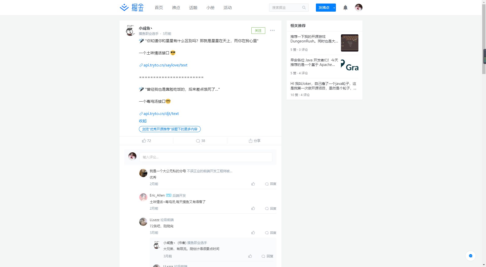
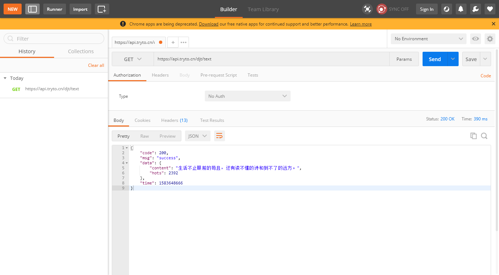
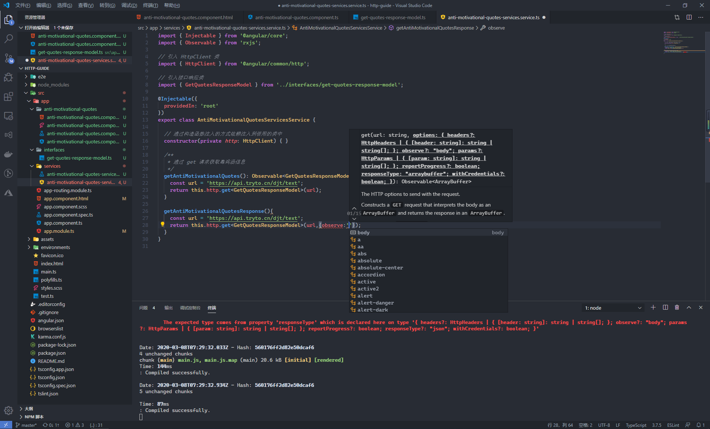
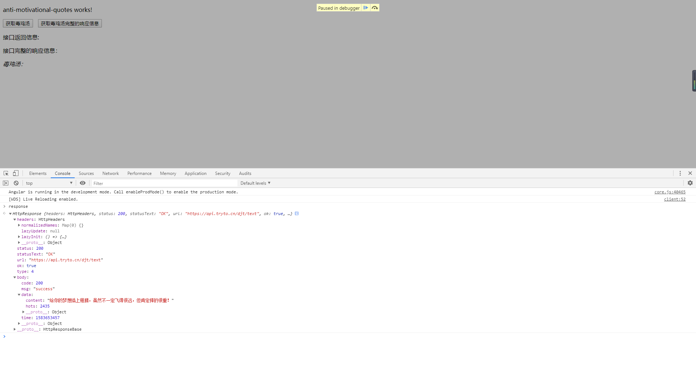
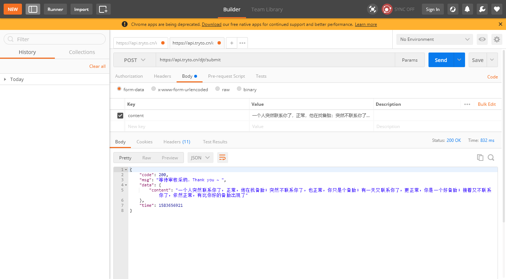
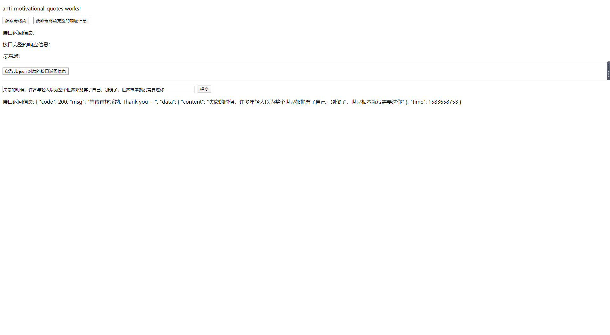
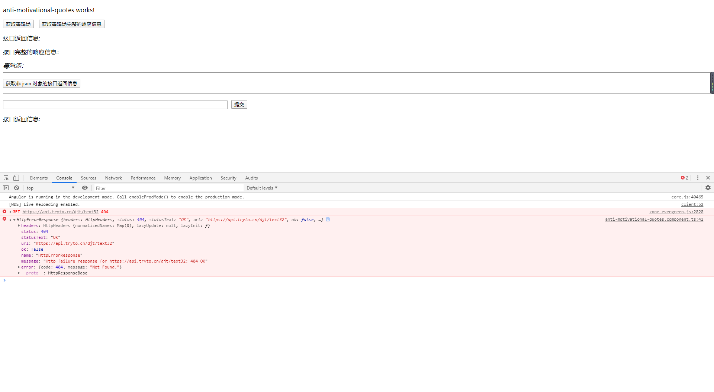
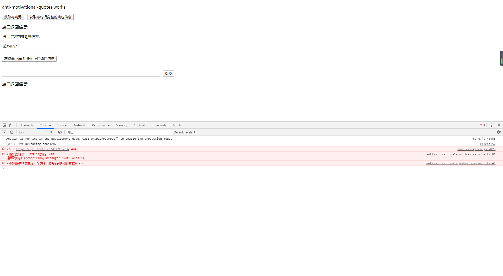
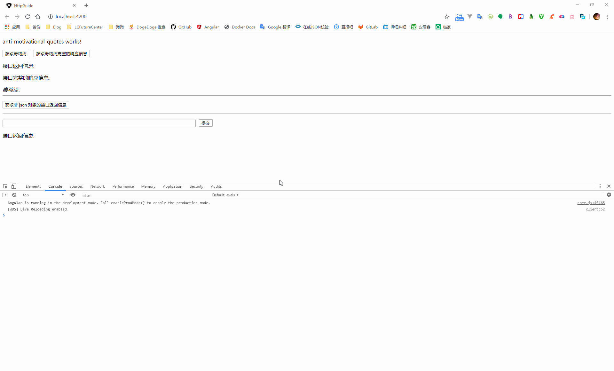

## Knowledge Graph


## Step by Step

### 1、与后端进行数据交互

#### 1.1、前置工作

在前端项目中，绝大多数都是通过 HTTP 协议和后端进行数据交互，现代浏览器支持两种方式向后端发起 HTTP 请求：XMLHttpRequest 和 fetch 

在以前的项目中，通常采用 jquery 的简化版 ajax 请求向后端请求数据，归根到底也是通过  XMLHttpRequest 与后端进行数据交互

在 Angular 中， 为了简化 XMLHttpRequest 的使用，框架提供了 HttpClient 类来封装 HTTP API，用来实现前端与后端的数据交互。

首先在应用的根模块中，引入 HttpClientModule 模块，并添加到根应用模块中

```typescript
import { BrowserModule } from '@angular/platform-browser';
import { NgModule } from '@angular/core';

import { AppRoutingModule } from './app-routing.module';
import { AppComponent } from './app.component';

// 添加对于 HttpClientModule 模块的引用
import { HttpClientModule } from '@angular/common/http';

@NgModule({
  declarations: [
    AppComponent
  ],
  imports: [
    BrowserModule,
    AppRoutingModule,
    HttpClientModule // 添加到根应用模块中
  ],
  providers: [],
  bootstrap: [AppComponent]
})
export class AppModule { }
```

在需要使用到的地方，引入 HttpClient 类，然后通过依赖注入的方式注入到应用类中。在通常情况下，我们需要将与一系列与后端进行交互的行为封装成服务，在这个服务中完成对于获取到的数据的处理，之后再注入到需要使用的组件中，从而确保组件中的仅仅是包含必要的业务逻辑处理

```typescript
import { Injectable } from '@angular/core';

// 引入 HttpClient 类
import { HttpClient } from '@angular/common/http';

@Injectable({
  providedIn: 'root'
})
export class AntiMotivationalQuotesServicesService {

  // 通过构造函数注入的方式依赖注入到使用的类中
  constructor(private http: HttpClient) { }
}
```

```typescript
import { Component, OnInit } from '@angular/core';

// 引入服务
import { AntiMotivationalQuotesServicesService } from './../services/anti-motivational-quotes-services.service';

@Component({
  selector: 'app-anti-motivational-quotes',
  templateUrl: './anti-motivational-quotes.component.html',
  styleUrls: ['./anti-motivational-quotes.component.scss']
})
export class AntiMotivationalQuotesComponent implements OnInit {

  // 通过构造函数注入的方式使用服务
  constructor(private services: AntiMotivationalQuotesServicesService) { }

  ngOnInit(): void {
  }

}
```


#### 1.2、从服务端获取数据

这里使用到的后端接口是掘金上一位朋友开发的毒鸡汤接口（[https://api.tryto.cn/djt/text](https://api.tryto.cn/djt/text)），所有权归属于[小咸鱼丶](https://juejin.im/user/594c8c326fb9a06bc23a6dfd)



通过使用 postman 进行接口调用可以发现，接口返回的对象信息如下



创建一个接口，按照接口返回的数据信息进行类属性的设置，用来映射接口返回的响应信息（Angular 只能将请求响应对象转换成接口类型，不能自动转换成类实例）

```bash
ng g interface interfaces/get-quotes-response-model
```

```typescript
export interface GetQuotesResponseModel {
  /**
   * 接口响应码
   */
  code: number;
  /**
   * 响应信息
   */
  msg: string;
  /**
   * 响应数据
   */
  data: ResponseData;
  /**
   * 响应时间
   */
  time: number;
}

/**
 * 接口响应的内容信息
 */
interface ResponseData {
  /**
   * 毒鸡汤
   */
  content: string;
  /**
   * 热度
   */
  hots: number;
}
```

在服务中，引入返回接口响应对象的接口定义，然后设定 get 请求的响应对象为 GetQuotesResponseModel，之后在使用时就可以直接通过响应对象接口获取响应的数据

```typescript
import { Injectable } from '@angular/core';
import { Observable } from 'rxjs';

// 引入 HttpClient 类
import { HttpClient } from '@angular/common/http';

// 引入接口响应类
import { GetQuotesResponseModel } from '../interfaces/get-quotes-response-model';

@Injectable({
  providedIn: 'root'
})
export class AntiMotivationalQuotesServicesService {

  // 通过构造函数注入的方式依赖注入到使用的类中
  constructor(private http: HttpClient) { }

  /**
   * 通过 get 请求获取毒鸡汤信息
   */
  getAntiMotivationalQuotes(): Observable<GetQuotesResponseModel> {
    const url = 'https://api.tryto.cn/djt/text';
    return this.http.get<GetQuotesResponseModel>(url);
  }
}
```

在组件中，通过调用注入的服务类完成接口数据的获取，因为是以一种结构化对象的方式获取到接口返回的数据，因此可以直接获取到指定的属性信息

```typescript
import { Component, OnInit } from '@angular/core';

// 引入服务
import { AntiMotivationalQuotesServicesService } from './../services/anti-motivational-quotes-services.service';

// 引入接口响应对象
import { GetQuotesResponseModel } from '../interfaces/get-quotes-response-model';

@Component({
  selector: 'app-anti-motivational-quotes',
  templateUrl: './anti-motivational-quotes.component.html',
  styleUrls: ['./anti-motivational-quotes.component.scss']
})
export class AntiMotivationalQuotesComponent implements OnInit {

  public quoteResponse: GetQuotesResponseModel;

  // 通过构造函数注入的方式使用服务
  constructor(private services: AntiMotivationalQuotesServicesService) { }

  ngOnInit(): void {
  }

  /**
   * 获取毒鸡汤
   */
  getQuotes() {
    this.services.getAntiMotivationalQuotes().subscribe((response: GetQuotesResponseModel) => {
      this.quoteResponse = response;
    });
  }
}
```
因为最终需要的信息是接口返回的响应信息对象中的一个属性，因此这里需要使用安全导航运算符（?）来确保模板的渲染不会因为空指针错误而中断

```html
<p>
  <button (click)="getQuotes()">获取毒鸡汤</button>
</p>
<p>
  接口返回信息: {{quoteResponse | json}}
</p>
<i>
  毒鸡汤：{{quoteResponse?.data?.content}}
</i>
```


在执行服务中的方法时，有时会存在没有回调函数的情况，此时也必须执行 subscribe 方法，否则服务中的 HTTP 请求是没有真正发起的

服务中的 getAntiMotivationalQuotes 只能获取到接口返回的 body 里面的信息，某些情况下需要获取到完整的响应信息，此时需要通过 observe 参数来告诉 HttpClient 此方法需要返回完整的响应信息



```typescript
import { Injectable } from '@angular/core';
import { Observable } from 'rxjs';

// 引入 HttpClient 类
import { HttpClient, HttpResponse } from '@angular/common/http';

// 引入接口响应类
import { GetQuotesResponseModel } from '../interfaces/get-quotes-response-model';

@Injectable({
  providedIn: 'root'
})
export class AntiMotivationalQuotesServicesService {

  // 通过构造函数注入的方式依赖注入到使用的类中
  constructor(private http: HttpClient) { }

  /**
   * 获取完整的接口请求信息
   */
  getAntiMotivationalQuotesResponse(): Observable<HttpResponse<GetQuotesResponseModel>> {
    const url = 'https://api.tryto.cn/djt/text';
    return this.http.get<GetQuotesResponseModel>(url, { observe: 'response' });
  }
}
```

```typescript
import { HttpResponse } from '@angular/common/http';
import { Component, OnInit } from '@angular/core';

// 引入服务
import { AntiMotivationalQuotesServicesService } from './../services/anti-motivational-quotes-services.service';

// 引入接口响应对象
import { GetQuotesResponseModel } from '../interfaces/get-quotes-response-model';

@Component({
  selector: 'app-anti-motivational-quotes',
  templateUrl: './anti-motivational-quotes.component.html',
  styleUrls: ['./anti-motivational-quotes.component.scss']
})
export class AntiMotivationalQuotesComponent implements OnInit {

  public quoteResponseInfo: HttpResponse<GetQuotesResponseModel>;

  // 通过构造函数注入的方式使用服务
  constructor(private services: AntiMotivationalQuotesServicesService) { }

  ngOnInit(): void {
  }

  /**
   * 获取毒鸡汤接口完整的请求信息
   */
  getQuotesResponse() {
    this.services.getAntiMotivationalQuotesResponse().subscribe((response: HttpResponse<GetQuotesResponseModel>) => {
      this.quoteResponseInfo = response;
    });
  }
}
```



HttpClient 默认的 get 方法返回的都是 json 对象，在后端接口返回的并不是 json 对象的情况下，需要手动的设置响应类型（text、blob、arraybuffer...）

```typescript
import { Injectable } from '@angular/core';
import { Observable } from 'rxjs';

// 引入 HttpClient 类
import { HttpClient, HttpResponse } from '@angular/common/http';

// 引入接口响应类
import { GetQuotesResponseModel } from '../interfaces/get-quotes-response-model';

@Injectable({
  providedIn: 'root'
})
export class AntiMotivationalQuotesServicesService {

  // 通过构造函数注入的方式依赖注入到使用的类中
  constructor(private http: HttpClient) { }
  
  /**
   * 获取响应类型非 json 对象的信息
   */
  getYuiterSitemap(): Observable<string> {
    const url = 'https://yuiter.com/sitemap.xml';
    return this.http.get(url, { responseType: 'text' });
  }
}
```


#### 1.3、提交数据到服务端

在同后端接口进行交互时，获取数据一般用的是 get 请求，而当进行数据新增、更新、删除时则会使用 post、put、delete 这三个 HTTP 谓词

在毒鸡汤这个接口中，可以调用 [https://api.tryto.cn/djt/submit](https://api.tryto.cn/djt/submit) 进行毒鸡汤的提交



根据 postman 的调用示例，在服务中定义一个方法用来提交毒鸡汤信息，这里的 SetQuotesResponseModel 为接口返回的响应对象

```typescript
import { Injectable } from '@angular/core';
import { Observable } from 'rxjs';

// 引入 HttpClient 类
import { HttpClient, HttpResponse } from '@angular/common/http';

// 引入接口响应类
import { SetQuotesResponseModel } from '../interfaces/set-quotes-response-model';

@Injectable({
  providedIn: 'root'
})
export class AntiMotivationalQuotesServicesService {

  // 通过构造函数注入的方式依赖注入到使用的类中
  constructor(private http: HttpClient) { }

  /**
   * 提交毒鸡汤信息
   * @param content 毒鸡汤
   */
  submitAntiMotivationalQuote(content: string): Observable<SetQuotesResponseModel> {
    const url = 'https://api.tryto.cn/djt/submit';
    return this.http.post<SetQuotesResponseModel>(url, {
      content
    });
  }
}
```



当需要更改请求的 MIME 类型或是需要在请求头中添加授权访问的 token 信息这一类的操作时，则需要在使用 HttpClient 提供的方法时添加上 HTTP 请求头配置

```typescript
import { Injectable } from '@angular/core';
import { Observable } from 'rxjs';

// 引入 HttpClient 类
import { HttpClient, HttpResponse, HttpHeaders } from '@angular/common/http';

@Injectable({
  providedIn: 'root'
})
export class AntiMotivationalQuotesServicesService {

  // 通过构造函数注入的方式依赖注入到使用的类中
  constructor(private http: HttpClient) { }

  public httpOptions = {
    headers: new HttpHeaders({
      'Content-Type': 'application/json',
      'Authorization': 'token'
    })
  };

  /**
   * 修改请求头信息
   */
  submitWithOptions() {
    const url = '';
    return this.http.post(url, {
      data: ''
    }, this.httpOptions);
  }
}
```


### 2、捕获错误信息

#### 2.1、获取错误信息

在涉及到前后端交互的过程中，不可避免会出现各种状况，在出现错误时，可以在 subscribe 方法中，添加第二个回调方法来获取错误信息

```typescript
getQuotes() {
    this.services.getAntiMotivationalQuotes().subscribe((response: GetQuotesResponseModel) => {
      this.quoteResponse = response;
    }, error => {
      console.error(error);
    });
}
```



在处理错误信息的回调方法中，返回了一个 HttpErrorResponse 对象用来显示错误信息。因为这里的错误更多是服务中与后端进行通信产生的错误，因此对于错误信息的捕获和处理更应该放到服务中进行，而在组件处仅显示错误提示

在服务中定义一个错误处理器，用来处理与后端请求中发生的错误

```typescript
import { Injectable } from '@angular/core';
import { Observable, throwError } from 'rxjs';
import { catchError, retry } from 'rxjs/operators';

// 引入 HttpClient 类
import { HttpClient, HttpResponse, HttpHeaders, HttpErrorResponse } from '@angular/common/http';

@Injectable({
  providedIn: 'root'
})
export class AntiMotivationalQuotesServicesService {

  // 通过构造函数注入的方式依赖注入到使用的类中
  constructor(private http: HttpClient) { }

  /**
   * 通过 get 请求获取毒鸡汤信息
   */
  getAntiMotivationalQuotes(): Observable<GetQuotesResponseModel> {
    const url = 'https://api.tryto.cn/djt/text32';
    return this.http.get<GetQuotesResponseModel>(url)
      .pipe(
        catchError(this.handleError)
      );
  }

  /**
   * 错误信息捕获处理
   * @param error 错误信息
   */
  private handleError(error: HttpErrorResponse) {

    if (error.error instanceof ErrorEvent) {
      // 客户端本身引起的错误信息
      console.error(`客户端错误：${error.error.message}`);
    } else {
      // 服务端返回的错误信息
      console.error(`服务端错误：HTTP 状态码：${error.status} \n\r 错误信息：${JSON.stringify(error.error)}`);
    }

    // 反馈给用户的错误信息（用于组件中使用 error 回调时的错误提示）
    return throwError('不好的事情发生了，毕竟我们都有不顺利的时候。。。');
  }
}
```

当请求发生错误时，通过在 HttpClient 方法返回的 Observable 对象中使用 pipe 管道将错误传递给自定义的错误处理器，从而完成捕获错误信息的后续操作



#### 2.2、请求重试

某些情况下存在因为特殊原因导致短时间的请求失败，在 pipe 管道中，当请求失败后，可以使用 retry 方法进行重试，在进行了多次重试后还是无法进行数据通信后，则进行错误捕获

```typescript
getAntiMotivationalQuotes(): Observable<GetQuotesResponseModel> {
    const url = 'https://api.tryto.cn/djt/text32';
    return this.http.get<GetQuotesResponseModel>(url)
      .pipe(
        retry(3), // 重试三次
        catchError(this.handleError) // 捕获错误信息
      );
}
```




### 3、请求拦截