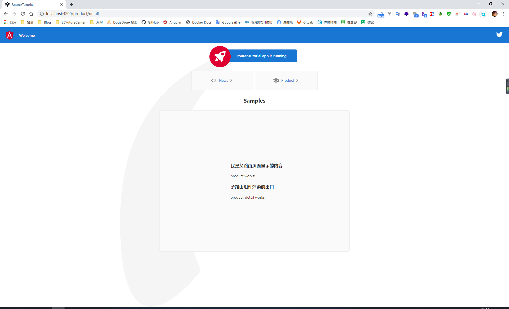

## Knowledge Graph


## Step by Step

### 1、基础概念

#### 1.1、base url

在 Angular 应用中，框架会自动将 index.html 文件中的 base url 配置作为组件、模板和模块文件的基础路径地址。默认的情况下 app 文件夹是整个应用的根目录，所以我们直接使用 index.html 中使用默认的 `<base href='/'>` 即可

```html
<!doctype html>
<html lang="en">
<head>
  <meta charset="utf-8">
  <title>RouterTutorial</title>
  <base href="/">
  <meta name="viewport" content="width=device-width, initial-scale=1">
  <link rel="icon" type="image/x-icon" href="favicon.ico">
</head>
<body>
  <app-root></app-root>
</body>
</html>
```

#### 1.2、路由的配置

在 Angular 项目中，系统的路由需要我们将一个 url 地址映射到一个展示的组件，因此需要手动的去设置 url 与组件之间的映射关系

因为我们在使用 Angular CLI 创建项目时，选择了添加路由模组，因此我们可以直接在 app-routing.module.ts 文件中完成路由的定义。最终我们定义的路由信息，都会在根模块中被引入到整个项目

```typescript
import { NgModule } from '@angular/core';
import { Routes, RouterModule } from '@angular/router';
import { HomeComponent } from './components/home/home.component';
import { PagenotfoundComponent } from './components/pagenotfound/pagenotfound.component';
import { NewsComponent } from './components/news/news.component';
import { ProductComponent } from './components/product/product.component';

// 配置路由信息
const routes: Routes = [
  { path: 'home', component: HomeComponent },
  { path: '', redirectTo: 'home', pathMatch: 'full' },
  { path: 'news', component: NewsComponent },
  { path: 'product', component: ProductComponent },
  { path: '**', component: PagenotfoundComponent },
];

@NgModule({
  imports: [RouterModule.forRoot(routes)],
  exports: [RouterModule]
})
export class AppRoutingModule { }
```

```typescript
import { BrowserModule } from '@angular/platform-browser';
import { NgModule } from '@angular/core';

import { AppRoutingModule } from './app-routing.module';

@NgModule({
  declarations: [
    AppComponent
  ],
  imports: [
    BrowserModule,
    AppRoutingModule // 引入路由配置信息
  ],
  providers: [],
  bootstrap: [AppComponent]
})
export class AppModule { }
```


当定义好路由信息后，我们需要在页面上使用 `<router-outlet>` 标签来告诉 Angular 在何处渲染出页面。对于路由之间的跳转，我们可以在 `a` 标签上通过使用 `RouterLink` 指令来绑定具体的路由来完成地址的跳转

```html
<div class="card-container">
    <a class="card" [routerLink]="[ '/news' ]" routerLinkActive="active">
      <span>News</span>
    </a>
    <a class="card" [routerLink]="[ '/product' ]" routerLinkActive="active">
      <span>Product</span>
    </a>

  </div>

  <div class="card-container">
    <div class="form-card">
      <!-- 组件渲染的出口 -->
      <router-outlet></router-outlet>
    </div>
  </div>
</div>
```

#### 1.3、重定向与通配地址

在普遍情况下，对于进入系统后的默认路径，我们会选择重定向到一个具体的地址上，这里我们在定义路由信息时，定义了一个空路径用来表示系统的默认地址，当用户请求时，重定向到 `/home` 路径上，因为只有完整的 url 地址匹配空字符串时才应该进行重定向操作，所以这里需要指定匹配模式是全部匹配


```typescript
const routes: Routes = [
  { path: 'home', component: HomeComponent },
  { path: '', redirectTo: 'home', pathMatch: 'full' }
];
```

Angular 在解析路由时，是按照我们定义的顺序依次进行的，一旦匹配就会立即终止。因此，类似于 404 错误的这种通配的路由配置，因为可以匹配上每个 url 地址，所以应该将路由的定义放到最后

```typescript
const routes: Routes = [
  { path: 'home', component: HomeComponent },
  { path: '', redirectTo: 'home', pathMatch: 'full' },
  { path: 'news', component: NewsComponent },
  { path: 'product', component: ProductComponent },
  { path: '**', component: PagenotfoundComponent },
];
```


从截图中可以看到，当我们打开系统时，会自动跳转到我们指定的 home 路径，点击菜单按钮后，则会加载对应的组件页面

#### 1.4、激活的路由

很多情况下，对于被选中的路由，我们可能会添加一个特定的样式来进行提示用户，因此，在我们定义 `router-link` 时，可以使用  `routerLinkActive` 属性绑定一个 css 的样式类，当该链接对应的路由处于激活状态时，则自动添加上指定的样式类


### 2、路由间的参数传递

在进行路由跳转时，很常见的一种使用情况是我们需要将某些数据作为参数传递到下一个页面中，例如从列表中选择一个数据，跳转到对应的详情页面。常见的参数传递有如下的两种方式

#### 2.1、query 查询参数传递

最常见的一种参数传递的方式，在需要跳转的路由地址后面加上参数和对应的值，在跳转后的页面通过获取参数 key 从而获取到对应的参数值

```html
<a href="www.yoursite.com/product?productId=xxxx">跳转</a>
```

对于直接通过 a 标签进行的路由跳转，我们可以在 a 标签上通过绑定 queryParams 属性来添加查询参数信息

这里通过 queryParams 属性绑定的是一个对象，Angular 会自动的帮我们将这个参数对象与 url 进行拼接。对于参数对象中的属性（key）对应的属性值（value），我们可以绑定一个组件中的属性进行动态的赋值，也可以通过添加单引号将参数值作为一个固定的数值，例如在下面代码中的两个查询参数就是固定的值

```html
<a class="card" [routerLink]="[ '/news' ]" routerLinkActive="active" [queryParams]="{category:'social',date:'2020-05-02'}">News</a>
```


同样的，我们也可以在 js 中完成路由的跳转，对于这种使用场景，我们需要在进行 js 跳转的组件类中通过构造函数依赖注入 Router 类，之后通过 Router 类的 navigate 方法完成路由的跳转；对于可能存在的查询参数，我们需要定义一个 NavigationExtras 类型的变量来进行设置

```typescript
import { Component, OnInit } from '@angular/core';

// 引入路由模块
import { Router, NavigationExtras } from '@angular/router';

@Component({
  selector: 'app-home',
  templateUrl: './home.component.html',
  styleUrls: ['./home.component.scss']
})
export class HomeComponent implements OnInit {

  constructor(private router: Router) {}

  ngOnInit(): void {}

  /**
   * 使用 js 的方式通过 query 查询字符串的形式传递参数
   */
  queryNavigate() {

    // 查询参数
    let query: NavigationExtras = {
      queryParams: {
        category: 'social',
        date: '2020-05-04'
      }
    };
    this.router.navigate(['/news' ], query);
  }
}
```

既然在进行跳转时附加了参数信息，在跳转后的页面我们肯定需要获取到传递的参数值。在 Angular 中，需要在组件类中依赖注入 ActivatedRoute 来获取传递的参数信息

这里的 queryParamMap 是一个 Observable 对象，所以这里需要使用 subscribe 方法来获取传递的参数值

```typescript
import { Component, OnInit } from '@angular/core';

// 引入路由模块
import { ActivatedRoute } from '@angular/router';

@Component({
  selector: 'app-news',
  templateUrl: './news.component.html',
  styleUrls: ['./news.component.scss']
})
export class NewsComponent implements OnInit {

  constructor(private route: ActivatedRoute) { }

  ngOnInit(): void {

    this.route.queryParamMap.subscribe((data: any) => {
      console.log(data.params);
    });
  }

}
```


#### 2.2、动态路由传递

与使用查询参数不同，使用动态路由进行参数传值时，需要我们在定义路由时就提供参数的占位符信息，例如在下面定义路由的代码里，对于组件所需的参数 newsId，我们需要在定义路由时就指明

```typescript
const routes: Routes = [
  { path: 'news/detail/:newsId', component: NewsDetailComponent },
];
```

对于采用动态路由进行的路由跳转，在 a 标签绑定的 routerLink 属性数组的第二个数据中，需要指定我们传递的参数值。例如这里的 item.newsId 这个变量就是我们需要传递的参数值

```html
<ul>
  <li *ngFor="let item of newsList; let i = index">
    <a [routerLink]="['/news/detail', item.newsId]" routerLinkActive="active" >
      {{item.title}}
    </a>
  </li>
</ul>
```

而采用 js 的方式进行跳转时，我们同样需要使用依赖注入的方式注入 Router 类，然后调用 navigate 方法进行跳转。与使用 query 查询参数传递数据不同，此时需要将跳转的链接与对应的参数值组合成为一个数组参数进行传递

```typescript
import { Component, OnInit } from '@angular/core';

// 引入路由模块
import { Router, ActivatedRoute } from '@angular/router';

@Component({
  selector: 'app-news',
  templateUrl: './news.component.html',
  styleUrls: ['./news.component.scss']
})
export class NewsComponent implements OnInit {

  newsList: any;

  constructor(private route: ActivatedRoute, private router: Router) {
    this.newsList = [{
      newsId: 1111,
      title: 'lalalalalallaaa'
    }, {
      newsId: 2222,
      title: 'lalalalalallaaa'
    }, {
      newsId: 3333,
      title: 'lalalalalallaaa'
    }];

  }

  ngOnInit(): void {
    this.route.queryParamMap.subscribe((data: any) => {
      console.log(data.params);
    });
  }

  routerNavigate() {
    this.router.navigate(['/news/detail', 11111]);
  }
}
```

在获取参数数据的组件类中，需要依赖注入 ActivatedRoute 类，因为是采用的动态路由的方式进行的参数传递，这里需要通过 paramMap 属性获取到对应的参数值

```typescript
import { Component, OnInit } from '@angular/core';

// 引入路由模块
import { ActivatedRoute } from '@angular/router';

@Component({
  selector: 'app-news-detail',
  templateUrl: './news-detail.component.html',
  styleUrls: ['./news-detail.component.scss']
})
export class NewsDetailComponent implements OnInit {

  constructor(private route: ActivatedRoute) { }

  ngOnInit(): void {
    this.route.paramMap.subscribe((data: any) => {
      console.log(data.params);
    });
  }
}
```


### 3、嵌套路由

在一些情况下，路由是存在嵌套关系的，例如下面这个页面，只有当我们点击资源这个顶部的菜单后，它才会显示出左侧的这些菜单，也就是说这个页面左侧的菜单的父级菜单是顶部的资源菜单


针对这种具有嵌套关系的路由，在定义路由时，我们需要通过配置 children 属性来指定路由之间的嵌套关系，例如这里我定义 ProductDetailComponent 这个组件和 ProductComponent 组件形成的路由之间具有嵌套关系

```typescript
// 配置路由信息
const routes: Routes = [
  {
    path: 'product', component: ProductComponent, children: [{
      path: 'detail', component: ProductDetailComponent
    }, {
      path: '', redirectTo: 'detail', pathMatch: 'full'
    }]
  }
];
```

因为子路由的渲染出口是在父路由的页面上，因此当嵌套路由配置完成之后，在嵌套的父级页面上，我们需要定义一个 `<router-outlet>` 标签用来指定子路由的渲染出口，最终的效果如下图所示

```html
<h3>我是父路由页面显示的内容</h3>
<p>product works!</p>

<!-- 加载子路由的数据 -->
<h3>子路由组件渲染的出口</h3>
<router-outlet></router-outlet>
```

