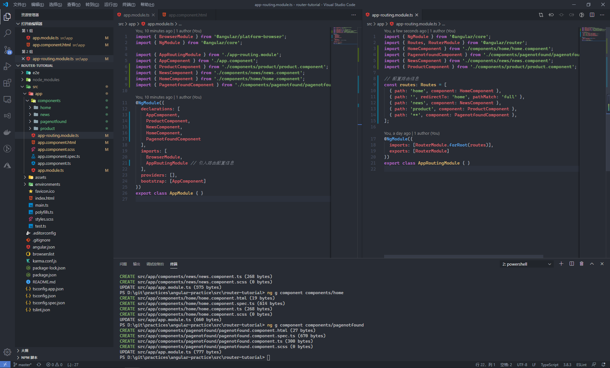
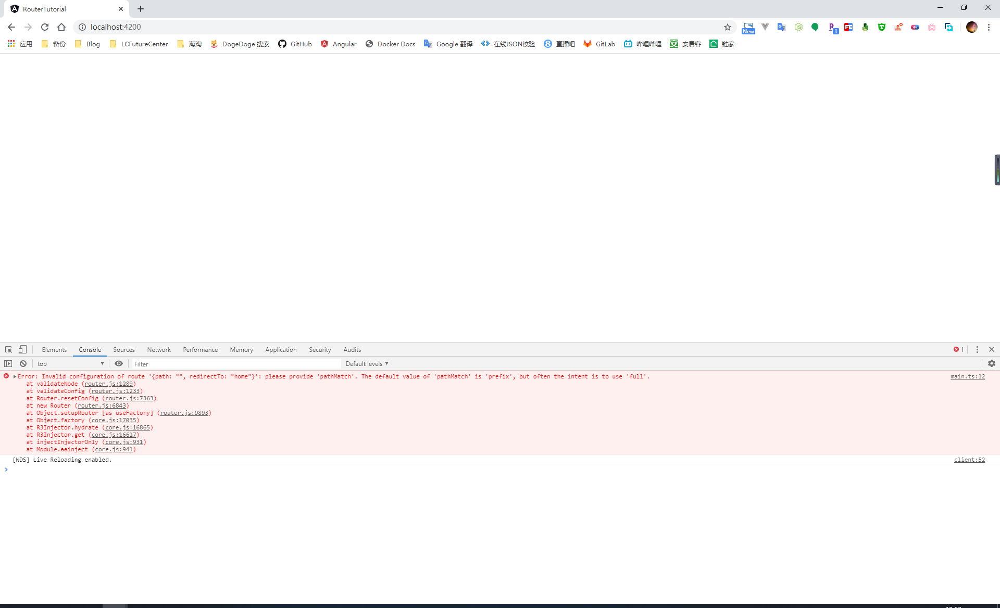
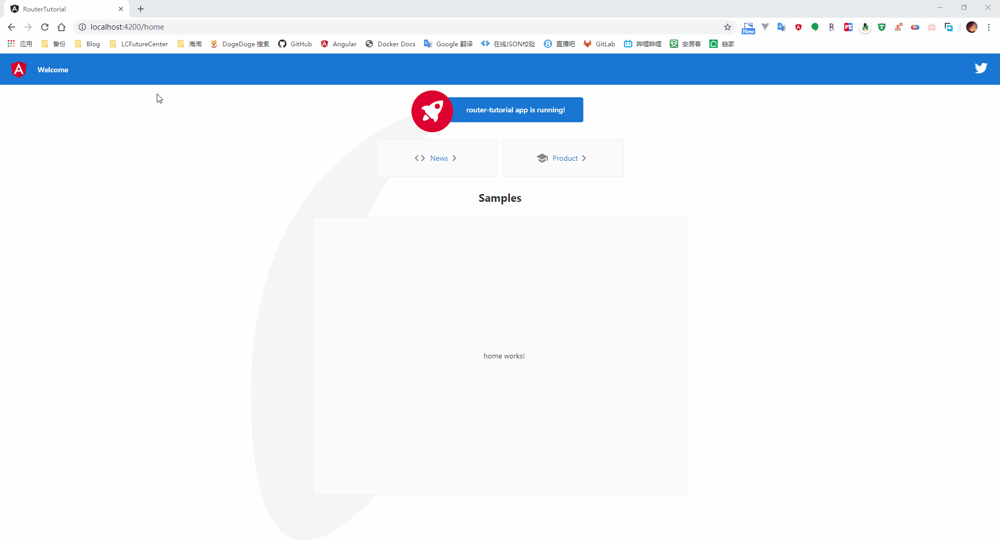
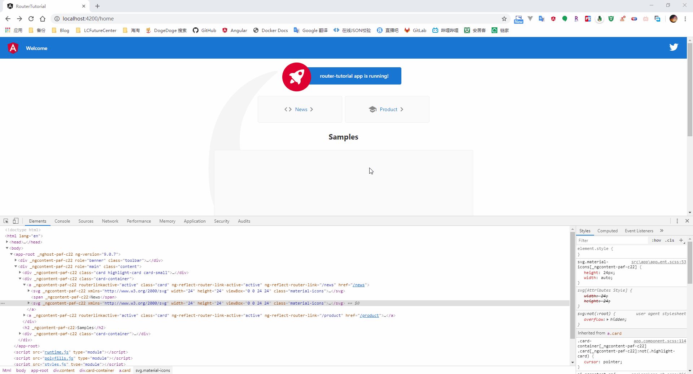
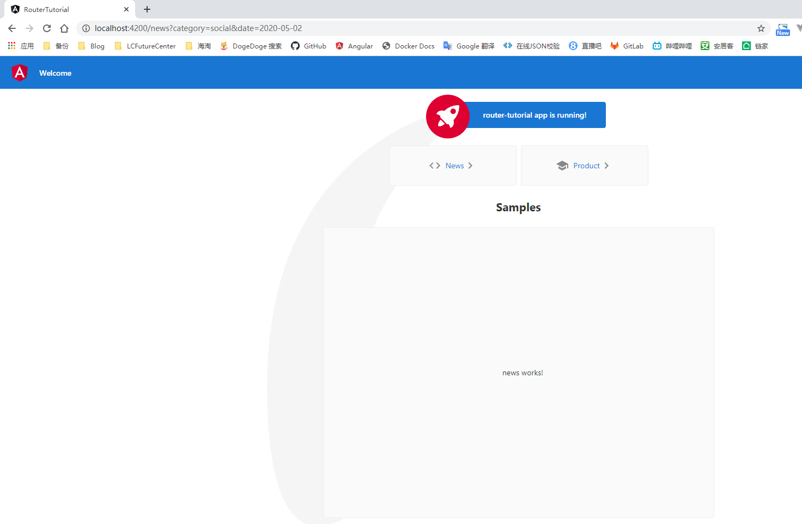
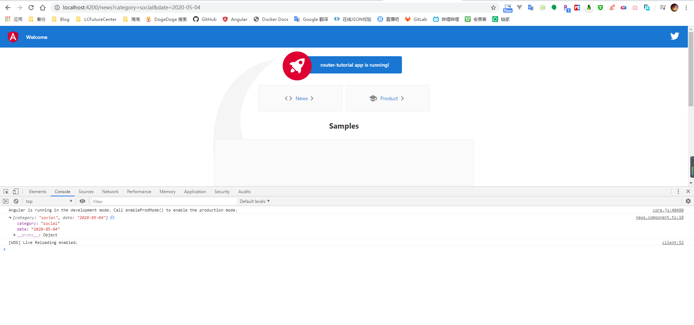
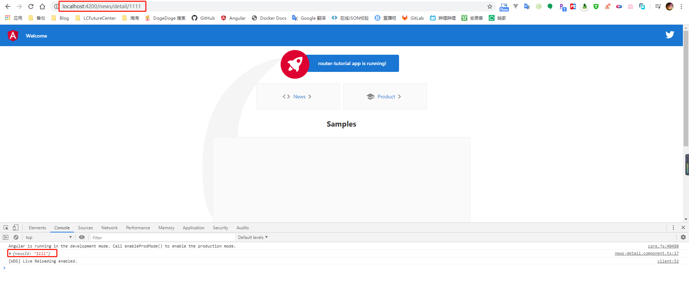
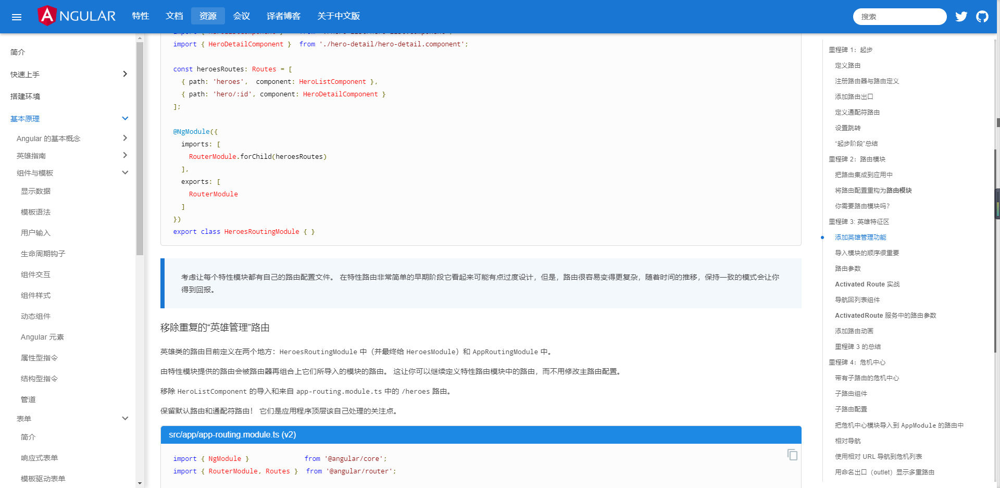

## Knowledge Graph


## Step by Step

### 1、基础概念

在定义路由信息之前，需要指定当前应用的根目录信息，在浏览期间，Angular 路由会使用 base href 作为组件、模板和模块文件的基础路径地址

默认的情况下 app 文件夹是整个应用的根目录，则只需要在 index.html 中使用默认的 `<base href='/'>` 即可

```html
<!doctype html>
<html lang="en">
<head>
  <meta charset="utf-8">
  <title>RouterTutorial</title>
  <base href="/">
  <meta name="viewport" content="width=device-width, initial-scale=1">
  <link rel="icon" type="image/x-icon" href="favicon.ico">
</head>
<body>
  <app-root></app-root>
</body>
</html>
```

在 Angular 中，需要将一个 url 地址映射到一个组件，因此需要手动的去设置对应的映射关系。在定义路由时，需要在文件中引入 Routes 和 RouterModule 从而进行路由地址的配置，最终在根模块中引入路由配置信息

```typescript
import { NgModule } from '@angular/core';
import { Routes, RouterModule } from '@angular/router';
import { HomeComponent } from './components/home/home.component';
import { PagenotfoundComponent } from './components/pagenotfound/pagenotfound.component';
import { NewsComponent } from './components/news/news.component';
import { ProductComponent } from './components/product/product.component';

// 配置路由信息
const routes: Routes = [
  { path: 'home', component: HomeComponent },
  { path: '', redirectTo: 'home', pathMatch: 'full' },
  { path: 'news', component: NewsComponent },
  { path: 'product', component: ProductComponent },
  { path: '**', component: PagenotfoundComponent },
];

@NgModule({
  imports: [RouterModule.forRoot(routes)],
  exports: [RouterModule]
})
export class AppRoutingModule { }
```

```typescript
import { BrowserModule } from '@angular/platform-browser';
import { NgModule } from '@angular/core';

import { AppRoutingModule } from './app-routing.module';

@NgModule({
  declarations: [
    AppComponent
  ],
  imports: [
    BrowserModule,
    AppRoutingModule // 引入路由配置信息
  ],
  providers: [],
  bootstrap: [AppComponent]
})
export class AppModule { }
```



默认情况下，系统都会有个默认跳转的地址，这里我们在定义路由信息时，定义了一个空路径用来表示系统的默认地址，用来将请求重定向到 `/home` 路径上，因为我们想要实现的是完整的 url 地址匹配空字符串时才进行重定向，所以这里需要指定匹配模式是全部匹配



在解析路由信息时，是按照我们定义的顺序依次解析的，一旦匹配就会立即终止。因此，类似于 404 错误的这种通配的路由信息因为可以匹配上每个 url 地址，所以应该将路由的定义放到最后

当定义好路由信息后，需要在页面上使用占位符用来渲染路由对应的组件信息，这里需要使用 `<router-outlet>` 标签来定义路由的出口

当有地方可以渲染出匹配的路由信息后，就可以在 `a` 标签上通过使用 `RouterLink` 指令来进行路由的匹配

```html
<div class="card-container">
    <a class="card" [routerLink]="[ '/news' ]" routerLinkActive="active">
      <span>News</span>
    </a>
    <a class="card" [routerLink]="[ '/product' ]" routerLinkActive="active">
      <span>Product</span>
    </a>

  </div>

  <div class="card-container">
    <div class="form-card">
      <!-- 组件渲染的出口 -->
      <router-outlet></router-outlet>
    </div>
  </div>
</div>
```



从截图中可以看到，当我们打开系统时，会自动跳转到我们指定的 home 路径，点击菜单按钮后，则会加载对应的组件信息

在某些情况下，对于被选中的路由，可能需要添加一个特定的样式来提示用户，在我们定义 router-link 时，可以在  routerLinkActive 中绑定一个 class 类，当该链接对应的路由处于激活状态时，则添加上对应的样式类




### 2、路由间的参数传递

在进行路由跳转时，很常见的一种使用情况是我们需要将某些数据作为参数传递到下一个页面中，例如从列表中选择一个数据，跳转到对应的详情页面。常见的参数传递有如下的两种方式

#### 2.1、query 查询参数传递

最常见的一种参数传递的方式，在需要跳转的路由地址后面加上参数和对应的值，通过获取参数 key 获取对应的参数值

```text
www.yoursite.com/product?productId=xxxx
```

对于直接通过 a 标签进行的路由跳转，我们可以在 a 标签上通过绑定 queryParams 属性来附加跳转页面时的查询参数信息

这里的 value 值可以是绑定一个组件中的属性进行动态的赋值，如果加上单引号，则代表这个参数值为一个固定的数值；因为这里绑定的是一个对象，所以我们可以添加多个参数，Angular 会自动的帮我们将这个对象参数在 url 中拼接起来

```html
<a class="card" [routerLink]="[ '/news' ]" routerLinkActive="active" [queryParams]="{category:'social',date:'2020-05-02'}">News</a>
```



很多时候，我们需要在 js 中完成的路由跳转，对于这种使用场景，我们需要在进行 js 跳转的组件类中通过构造函数依赖注入 Router 类，之后通过 Router 类的 navigate 方法完成路由的跳转；对于查询参数，我们需要定义一个 NavigationExtras 类型的变量来进行设置

```typescript
import { Component, OnInit } from '@angular/core';

// 引入路由模块
import { Router, NavigationExtras } from '@angular/router';

@Component({
  selector: 'app-home',
  templateUrl: './home.component.html',
  styleUrls: ['./home.component.scss']
})
export class HomeComponent implements OnInit {

  constructor(private router: Router) {}

  ngOnInit(): void {}

  /**
   * 使用 js 的方式通过 query 查询字符串的形式传递参数
   */
  queryNavigate() {

    // 查询参数
    let query: NavigationExtras = {
      queryParams: {
        category: 'social',
        date: '2020-05-04'
      }
    };
    this.router.navigate(['/news' ], query);
  }
}
```

既然在进行跳转时选择传递参数信息，在跳转后的页面我们肯定要获取到对应的参数值进行操作，在跳转后的组件类中，需要依赖注入 ActivatedRoute 获取跳转传递的参数信息

这里的 queryParamMap 是一个 Observable 对象，所以这里需要使用 subscribe 方法来获取传递的参数值

```typescript
import { Component, OnInit } from '@angular/core';

// 引入路由模块
import { ActivatedRoute } from '@angular/router';

@Component({
  selector: 'app-news',
  templateUrl: './news.component.html',
  styleUrls: ['./news.component.scss']
})
export class NewsComponent implements OnInit {

  constructor(private route: ActivatedRoute) { }

  ngOnInit(): void {

    this.route.queryParamMap.subscribe((data: any) => {
      console.log(data.params);
    });
  }

}
```



#### 2.2、动态路由传递

与在路由地址上添加查询参数不同，使用动态路由进行参数传值时，需要我们在定义路由时就提供参数的占位符信息，例如我们在下面定义路由时，需要在路径中指明需要的参数 newsId

```typescript
const routes: Routes = [
  { path: 'news/detail/:newsId', component: NewsDetailComponent },
];
```

与使用 query 查询参数传递数据参数数据不同，对于采用动态路由传递参数的形式进行的路由跳转，我们需要在 a 标签上绑定的 routerLink 属性值数组的第二个数据指定我们传递的参数值。例如这里的 item.newsId 这个变量就是我们需要传递的参数值

```html
<ul>
  <li *ngFor="let item of newsList; let i = index">
    <a [routerLink]="['/news/detail', item.newsId]" routerLinkActive="active" >
      {{item.title}}
    </a>
  </li>
</ul>
```

当采用 js 的方式进行跳转时，我们同样需要使用依赖注入的方式注入 Router 类，然后调用 navigate 方法。与使用 query 查询参数传递数据不同，需要将跳转的链接与对应的参数值组合成为一个数组参数进行传递

```typescript
import { Component, OnInit } from '@angular/core';

// 引入路由模块
import { Router, ActivatedRoute } from '@angular/router';

@Component({
  selector: 'app-news',
  templateUrl: './news.component.html',
  styleUrls: ['./news.component.scss']
})
export class NewsComponent implements OnInit {

  newsList: any;

  constructor(private route: ActivatedRoute, private router: Router) {
    this.newsList = [{
      newsId: 1111,
      title: 'lalalalalallaaa'
    }, {
      newsId: 2222,
      title: 'lalalalalallaaa'
    }, {
      newsId: 3333,
      title: 'lalalalalallaaa'
    }];

  }

  ngOnInit(): void {
    this.route.queryParamMap.subscribe((data: any) => {
      console.log(data.params);
    });
  }

  routerNavigate() {
    this.router.navigate(['/news/detail', 11111]);
  }
}
```

在跳转后的组件类中，需要依赖注入 ActivatedRoute 获取跳转传递的参数信息。因为是采用的动态路由的方式进行的参数传递，这里需要通过 paramMap 属性获取到对应的参数值

```typescript
import { Component, OnInit } from '@angular/core';

// 引入路由模块
import { ActivatedRoute } from '@angular/router';

@Component({
  selector: 'app-news-detail',
  templateUrl: './news-detail.component.html',
  styleUrls: ['./news-detail.component.scss']
})
export class NewsDetailComponent implements OnInit {

  constructor(private route: ActivatedRoute) { }

  ngOnInit(): void {
    this.route.paramMap.subscribe((data: any) => {
      console.log(data.params);
    });
  }
}
```




### 3、嵌套路由

在一些情况下，路由是存在一种嵌套关系的，例如 Angular 官网资源这个页面左边的菜单，它只会在打开资源这个父级菜单后才会显示



23

```typescript

```