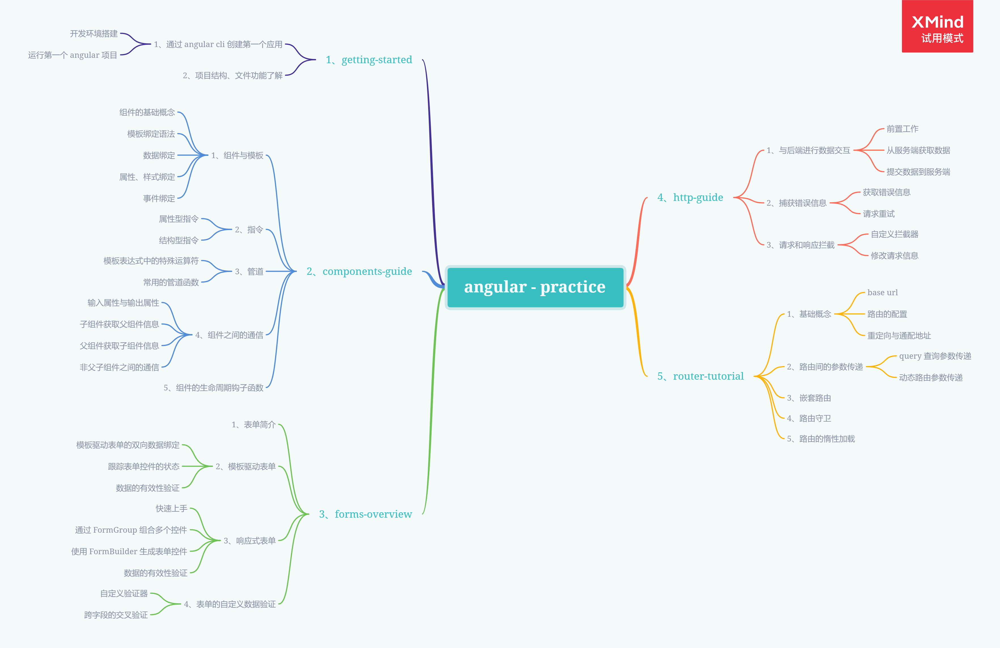
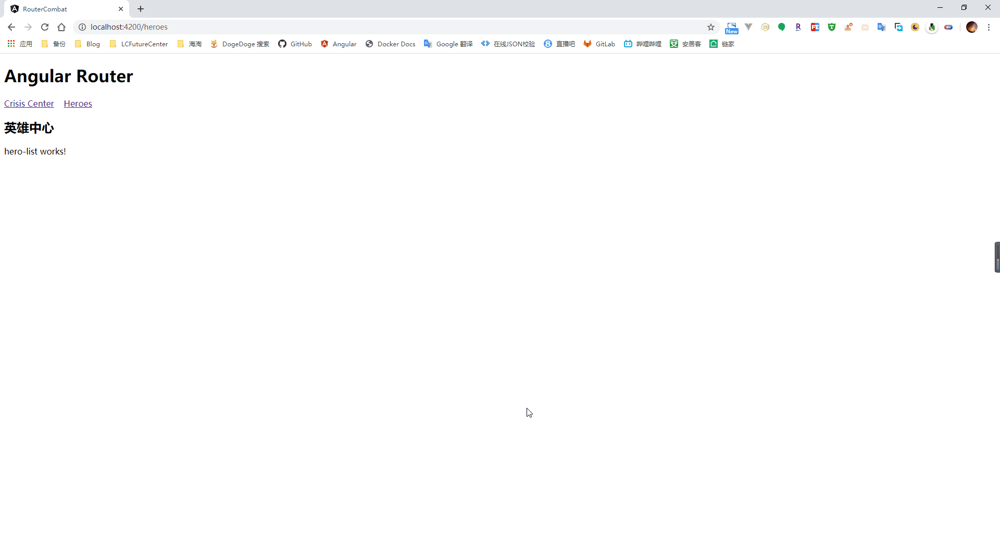
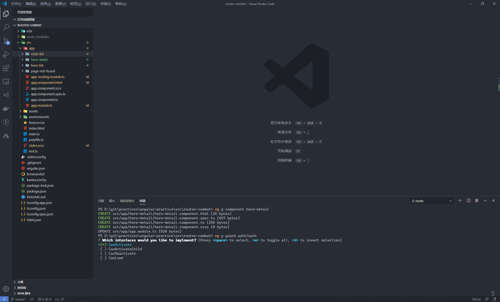
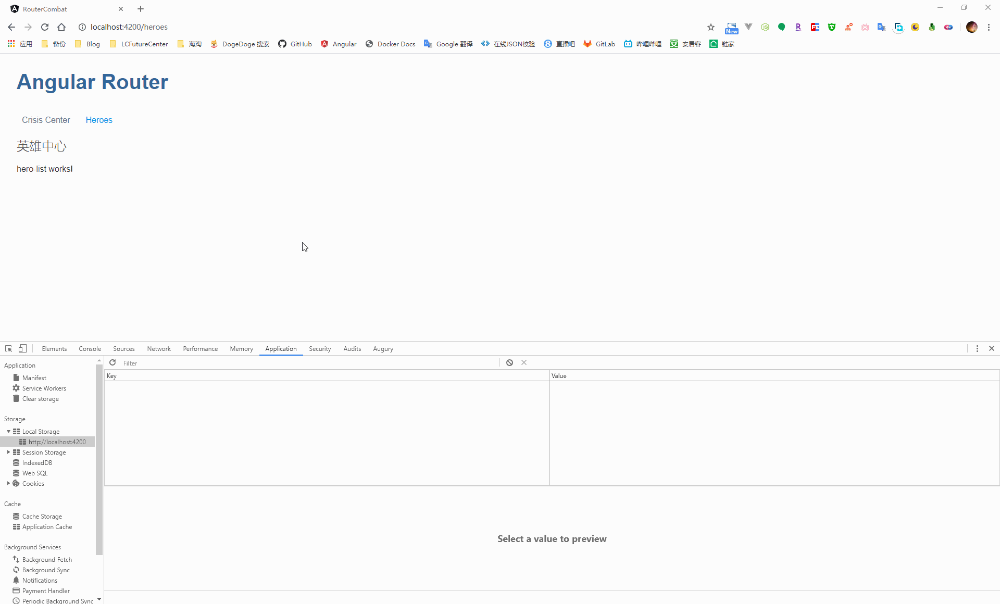
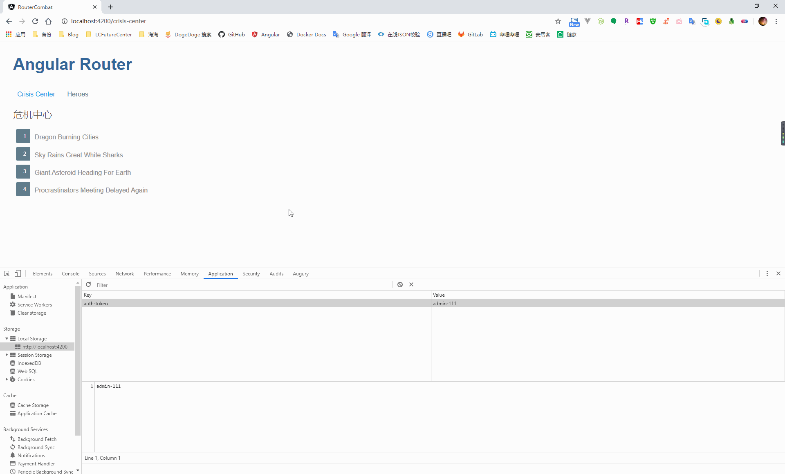
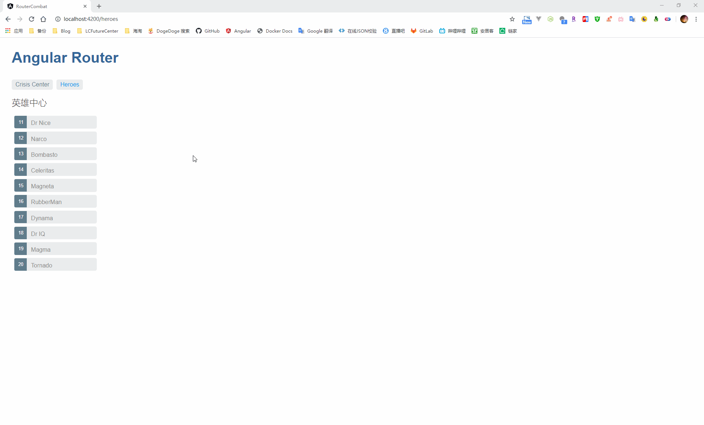

## Knowledge Graph




## Step by Step

### 1、基础准备

重复上一篇笔记的内容，搭建一个包含路由信息的项目

新建四个组件，分别对应于三个实际使用到的页面与一个通配的 404 页面

```powershell
-- 危机中心页面
ng g component crisis-list

-- 英雄中心页面
ng g component hero-list

-- 英雄相亲页面
ng g component hero-detail

-- 404 页面
ng g component page-not-found 
```

在 app-routing.module.ts 文件中完成路由的定义，这里包含了对于路由的重定向、通配路由，以及使用动态路由传参的使用

```typescript
import { NgModule } from '@angular/core';
import { Routes, RouterModule } from '@angular/router';

// 引入组件
import { CrisisListComponent } from './crisis-list/crisis-list.component';
import { HeroListComponent } from './hero-list/hero-list.component';
import { HeroDetailComponent } from './hero-detail/hero-detail.component';
import { PageNotFoundComponent } from './page-not-found/page-not-found.component';

const routes: Routes = [
  {
    path: 'crisis-center',
    component: CrisisListComponent,
  },
  {
    path: 'heroes',
    component: HeroListComponent,
  },
  {
    path: 'hero/:id',
    component: HeroDetailComponent,
  },
  {
    path: '',
    redirectTo: '/heroes',
    pathMatch: 'full',
  },
  {
    path: '**',
    component: PageNotFoundComponent,
  }
];

@NgModule({
  imports: [RouterModule.forRoot(routes)],
  exports: [RouterModule],
})
export class AppRoutingModule { }
```

之后，在根组件中，添加 router-outlet 标签用来声明路由在页面上渲染的出口

```html
<h1>Angular Router</h1>
<nav>
  <a routerLink="/crisis-center" routerLinkActive="active">Crisis Center</a> &nbsp;&nbsp;
  <a routerLink="/heroes" routerLinkActive="active">Heroes</a>
</nav>
<router-outlet></router-outlet>
```




### 2、路由守卫

在 Angular 中，路由守卫主要可以解决以下的问题

- 对于用户访问页面的权限校验（是否已经登录？已经登录的角色是否有权限进入？）
- 在跳转到组件前获取某些必须的数据
- 离开页面时，提示用户是否保存未提交的修改

Angular 路由模块提供了如下的几个接口用来帮助我们解决上面的问题

- CanActivate：用来处理系统跳转到到某个路由地址的操作（判断是否可以进行访问）
- CanActivateChild：功能同 CanActivate，只不过针对的是子路由
- CanDeactivate：用来处理从当前路由离开的情况（判断是否存在未提交的信息）
- CanLoad：是否允许通过延迟加载的方式加载某个模块 

在添加了路由守卫之后，通过路由守卫返回的值，从而达到我们控制路由的目的

- true：导航将会继续
- false：导航将会中断，用户停留在当前的页面或者是跳转到指定的页面
- UrlTree：取消当前的导航，并导航到路由守卫的这个 UrlTree 上（一个新的路由信息）

#### 2.1、CanActivate：认证授权

在实现路由守卫接口之前，我们需要通过 Angular CLI 命令来生成接口实现类，通过命令行，在 app/auth 路由下生成一个授权守卫类，CLI 会提示我们选择继承的路由守卫接口，这里选择 CanActivate 即可

```shell
ng g guard auth/auth
```



在 AuthGuard 这个路由守卫类中，我们模拟对于一个路由地址的访问是否允许。首先判断是否已经登录了，如果登录后再判断当前登录人是否具有当前路由的访问权限

```typescript
import { Injectable } from '@angular/core';
import { CanActivate, ActivatedRouteSnapshot, RouterStateSnapshot, UrlTree, Router } from '@angular/router';
import { Observable } from 'rxjs';

@Injectable({
  providedIn: 'root'
})
export class AuthGuard implements CanActivate {

  /**
   * ctor
   * @param router 路由
   */
  constructor(private router: Router) { }

  canActivate(
    next: ActivatedRouteSnapshot,
    state: RouterStateSnapshot): Observable<boolean | UrlTree> | Promise<boolean | UrlTree> | boolean | UrlTree {

    // 判断是否有 token 信息
    let token = localStorage.getItem('auth-token');
    if (token === '') {
      this.router.navigate(['/login']);
      return false;
    }

    // 判断是否可以访问当前连接
    let url: string = state.url;
    if (token === 'admin' && url === '/crisis-center') {
      return true;
    }

    this.router.navigate(['/login']);
    return false;
  }
}
```

之后我们就可以在 app-routing.module.ts 文件中引入 AuthGuard 类，针对需要保护的路由进行配置

```typescript
import { NgModule } from '@angular/core';
import { Routes, RouterModule } from '@angular/router';

// 引入组件
import { CrisisListComponent } from './crisis-list/crisis-list.component';

// 引入路由守卫
import { AuthGuard } from './auth/auth.guard';

const routes: Routes = [
  {
    path: 'crisis-center',
    component: CrisisListComponent,
    canActivate: [AuthGuard], // 添加针对当前路由的 canActivate 路由守卫
  }
];

@NgModule({
  imports: [RouterModule.forRoot(routes)],
  exports: [RouterModule],
})
export class AppRoutingModule { }
```



#### 2.2、CanActivateChild：针对子路由的认证授权

与继承 CanActivate 接口进行路由守卫的方式相同，针对子路由可以通过继承  CanActivateChild 接口来达到对于子路由的认证授权，这里通过多重继承的方式，扩展 AuthGuard 的功能，从而达到同时针对路由和之路由的认证授权

改造下原先 canActivate 方法的实现，判断用户的 token 信息中包含 admin 即可访问 crisis-center 页面，在针对子路由进行认证授权的 canActivateChild 方法中，通过判断 token 信息是否为 admin-master 模拟对于子路由的认证

```typescript
import { Injectable } from '@angular/core';
import { CanActivate, ActivatedRouteSnapshot, RouterStateSnapshot, UrlTree, Router, CanActivateChild } from '@angular/router';
import { Observable } from 'rxjs';

@Injectable({
  providedIn: 'root'
})
export class AuthGuard implements CanActivate, CanActivateChild {

  /**
   * ctor
   * @param router 路由
   */
  constructor(private router: Router) { }

  canActivate(
    next: ActivatedRouteSnapshot,
    state: RouterStateSnapshot): Observable<boolean | UrlTree> | Promise<boolean | UrlTree> | boolean | UrlTree {

    // 判断是否有 token 信息
    let token = localStorage.getItem('auth-token');
    if (token === '') {
      this.router.navigate(['/login']);
      return false;
    }

    // 判断是否可以访问当前连接
    let url: string = state.url;
    if (token.indexOf('admin') !== -1 && url.indexOf('/crisis-center') !== -1) {
      return true;
    }

    this.router.navigate(['/login']);
    return false;
  }

  canActivateChild(
    childRoute: ActivatedRouteSnapshot,
    state: RouterStateSnapshot): boolean | UrlTree | Observable<boolean | UrlTree> | Promise<boolean | UrlTree> {
    let token = localStorage.getItem('auth-token');
    if (token === '') {
      this.router.navigate(['/login']);
      return false;
    }

    return token === 'admin-master';
  }
}
```

通过 Angular CLI 新增一个 crisis-detail 组件，作为 crisis-list 的子组件

```shell
ng g component crisis-detail
```

接下来在 crisis-list 中添加 router-outlet 标签，用来定义子路由的渲染出口

```html
<h2>危机中心</h2>

<ul class="crises">
  <li *ngFor="let crisis of crisisList">
    <a [routerLink]="[crisis.id]">
      <span class="badge">{{ crisis.id }}</span>{{ crisis.name }}
    </a>
  </li>
</ul>

<!-- 定义子路由的渲染出口 -->
<router-outlet></router-outlet>
```

在针对子路由的认证授权配置时，我们可以选择针对每个子路由添加 canActivateChild 属性，也可以定义一个空地址的子路由，将所有归属于 crisis-list 的子路由作为这个空的子路由的子路由，通过针对这个空路径添加 canActivateChild 属性，从而达到将守护规则应用到所有的子路由上

这里其实相当于将原先两级的路由模式（父：crisis-list，子：crisis-detail）改成了三级（父：crisis-list，子：crisis-list（空路径），孙：crisis-detail）

```typescript
import { NgModule } from '@angular/core';
import { Routes, RouterModule } from '@angular/router';

// 引入组件
import { CrisisListComponent } from './crisis-list/crisis-list.component';
import { CrisisDetailComponent } from './crisis-detail/crisis-detail.component';

// 引入路由守卫
import { AuthGuard } from './auth/auth.guard';

const routes: Routes = [
  {
    path: 'crisis-center',
    component: CrisisListComponent,
    canActivate: [AuthGuard], // 添加针对当前路由的 canActivate 路由守卫
    children: [{
      path: '',
      canActivateChild: [AuthGuard], // 添加针对子路由的 canActivate 路由守卫
      children: [{
        path: 'detail',
        component: CrisisDetailComponent
      }]
    }]
  }
];

@NgModule({
  imports: [RouterModule.forRoot(routes)],
  exports: [RouterModule],
})
export class AppRoutingModule { }
```



#### 2.3、CanDeactivate：处理用户未提交的修改

当进行表单填报之类的操作时，因为会涉及到一个提交的动作，当用户没有点击保存按钮就离开时，最好能暂停，对用户进行一个友好性的提示，由用户选择后续的操作

创建一个路由守卫，继承于 CanDeactivate 接口

```shell
ng g guard hero-list/guards/hero-can-deactivate
```

与上面的 CanActivate、CanActivateChild 路由守卫不同，对于 CanDeactivate 守卫来说，我们需要将参数中的 unknown 替换成我们实际需要进行路由守卫的组件

```typescript
import { Injectable } from '@angular/core';
import { CanDeactivate, ActivatedRouteSnapshot, RouterStateSnapshot, UrlTree } from '@angular/router';
import { Observable } from 'rxjs';

@Injectable({
  providedIn: 'root'
})
export class HeroCanDeactivateGuard implements CanDeactivate<unknown> {
  canDeactivate(
    component: unknown,
    currentRoute: ActivatedRouteSnapshot,
    currentState: RouterStateSnapshot,
    nextState?: RouterStateSnapshot): Observable<boolean | UrlTree> | Promise<boolean | UrlTree> | boolean | UrlTree {
    return true;
  }
  
}
```

例如，这里我是需要针对 HeroListComponent 这个组件进行的路由守卫，因此我们需要将泛型的参数 unknown 改为 HeroDetailComponent，通过 component 参数，我们可以对当前需要进行守卫的组件的数据进行校对确认

```typescript
import { Injectable } from '@angular/core';
import {
  CanDeactivate,
  ActivatedRouteSnapshot,
  RouterStateSnapshot,
  UrlTree,
} from '@angular/router';
import { Observable } from 'rxjs';

// 引入需要进行路由守卫的组件
import { HeroListComponent } from '../hero-list.component';

@Injectable({
  providedIn: 'root',
})
export class HeroCanDeactivateGuard
  implements CanDeactivate<HeroListComponent> {
  canDeactivate(
    component: HeroListComponent,
    currentRoute: ActivatedRouteSnapshot,
    currentState: RouterStateSnapshot,
    nextState?: RouterStateSnapshot
  ):
    | Observable<boolean | UrlTree>
    | Promise<boolean | UrlTree>
    | boolean
    | UrlTree {

    // 判断是否修改了原始数据
    //
    const data = component.hero;
    if (data === undefined) {
      return true;
    }
    const origin = component.heroList.find(hero => hero.id === data.id);
    if (data.name === origin.name) {
      return true;
    }

    return window.confirm('内容未提交，确认离开？');
  }
}
```

这里模拟比对用户有没有修改数据，当修改数据并移动到别的页面时，则提示用户是否离开当前页面



#### 2.2、Resolve：预先获取组件数据


### 3、惰性路由加载

