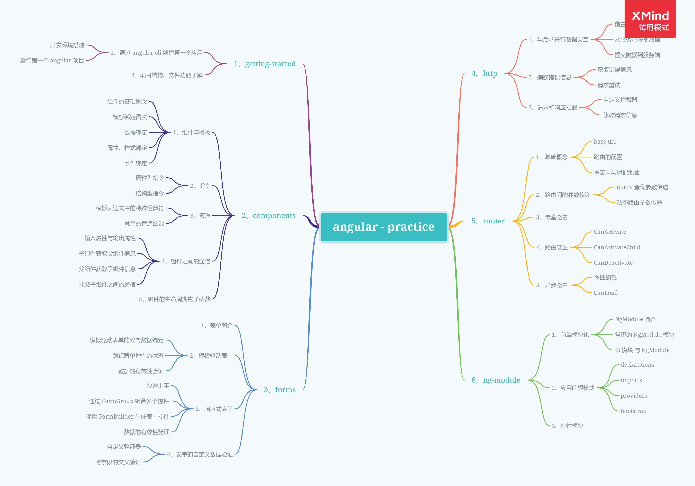
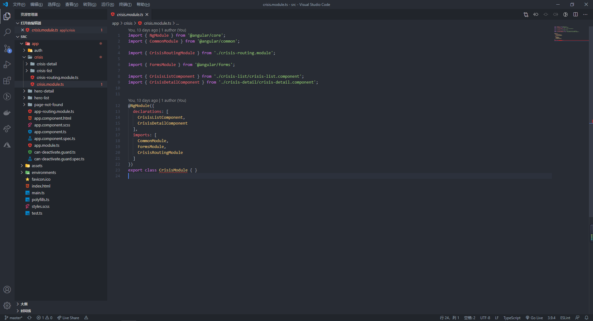

## Knowledge Graph




## Step by Step

### 1、前端模块化

前端模块化是指将程序中一组相关的功能按照一定的规则组织在一块，整个模块内部的数据和功能实现是私有的，通过 export 暴露其中的一些接口（方法）与系统中的别的模块进行通信

#### 1.1、NgModule 简介

在 Angular 应用中，至少会存在一个 NgModule，也就是应用的根模块（AppModule）,通过引导这个根模块就可以启动整个项目。而像开发中使用到 FormsModule、HttpClientModule 这种 Angular 内置的库也都是一个个的 NgModule，通过将组件、指令、管道、服务或其它的代码文件聚合成一个内聚的功能块，专注于某个功能模块

#### 1.2、JavaScript 模块与 NgModule 

在 JavaScript 中，每一个 js 文件就是一个模块，文件中定义的所有对象都从属于那个模块。 通过 `export` 关键字，模块可以把其中的某些对象声明为公共的，从而其它 JavaScript 模块可以使用 `import ` 语句来访问这些公共对象

例如下面的示例代码中，别的 javascript 模块可以通过导入到这个 js 文件来直接使用暴露的 `getRoles` 和 `getUserInfo` 方法

```javascript
function getRoles() {
    // ...
}

function getUserInfo() {
    // ...
}

export {
    getRoles,
    getUserInfo
}
```

NgModule 是一个带有 @NgModule 装饰器的类，通过函数的参数来描述这个模块，例如在上节笔记中创建的 CrisisModule，定义了我们在该特性模块中创建的组件，以及需要使用到的其它模块



在使用 @NgModule 装饰器时，通常会使用到下面的属性来定义一个模块

- declarations：当前模块中的组件、指令、管道

- imports：当前模块所需的其它 NgModule 模块

- exports：其它模块中可以使用到当前模块可声明的对象

- providers：当前模块像当前应用中其它应用模块暴露的服务

- bootstrap：用来定义整个应用的根组件，是应用中所有其它视图的宿主，只有根模块中才会存在

  

### 2、应用的根模块

根模块是用来启动此 Angular 应用的模块， 按照惯例，它通常命名为 `AppModule`。通过 Angular CLI 新建一个应用后，默认的根模块代码如下，同过使用 @NgModule 装饰器装饰 AppModule 类，定义了这个模块的一些属性特征，从而告诉 Angular 如何编译和启动本应用

```typescript
import { BrowserModule } from '@angular/platform-browser';
import { NgModule } from '@angular/core';

import { AppRoutingModule } from './app-routing.module';
import { AppComponent } from './app.component';

@NgModule({
  declarations: [
    AppComponent
  ],
  imports: [
    BrowserModule,
    AppRoutingModule
  ],
  providers: [],
  bootstrap: [AppComponent]
})
export class AppModule { }
```

#### 2.1、declarations

`declarations` 数组告诉 Angular 哪些组件属于当前模块。 当创建新的组件时，需要将它们添加到 `declarations` 数组中。每个组件都只能声明在一个 `NgModule` 类中，同时如果你使用了未声明过的组件，Angular 就会报错

#### 2.2、imports

#### 2.3、providers

#### 2.4、bootstrap


### 3、特性模块